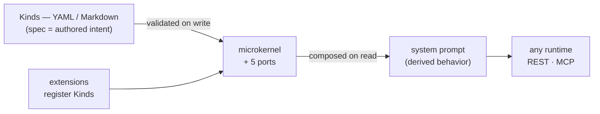

# DNA — Domain Notation of Anything

[](https://github.com/ruinosus/dna/actions/workflows/python.yml)
[](https://github.com/ruinosus/dna/actions/workflows/typescript.yml)
[](https://github.com/ruinosus/dna/actions/workflows/guards.yml)
[](https://github.com/ruinosus/dna/actions/workflows/docs.yml)
[](#status)
[](LICENSE)

**Kubernetes CRDs, but for agentic behavior.**

> DNA is a declarative, typed notation for everything that participates in an
> agentic system — agents, skills, souls, guardrails, tools, policies. Every
> participant is identified by `(apiVersion, kind)`, validated against a
> per-Kind schema, and stored as versionable YAML/Markdown. **The `spec` you
> author is intent; the composed prompt is derived. Changing an agent is a
> file edit, not a deploy.**

```yaml
apiVersion: github.com/ruinosus/dna/v1
kind: Agent
metadata:
  name: greeter
spec:
  instruction: |
    You are Helio, a friendly assistant.
  skills: [verification-before-completion]   # a real marketplace skill
```

The whole idea in one picture:



📖 **Full documentation: [ruinosus.github.io/dna](https://ruinosus.github.io/dna/)**
· [The thesis](https://ruinosus.github.io/dna/concepts/thesis/)
· [Your first Kind](https://ruinosus.github.io/dna/getting-started/first-kind/)

## Install

```bash
pip install dna-sdk dna-cli      # the runtime: Python SDK + the `dna` CLI
npm install dna-client           # TypeScript client for the REST API
pip install dna-client           # Python client for the REST API
```

The **runtime is Python**. Everything else talks to it over **REST or MCP** —
see [Talking to DNA from another language](#talking-to-dna-from-another-language).

Pre-release / exact-pin alternative — consume straight from the repo
(`cd packages/sdk-py && uv sync`), as the quick start below does. See [RELEASING.md](RELEASING.md) for how versions
are cut.

## Make your project agent-ready — `dna init`

One command makes *your* repository agent-ready — so the AI coding agent
working in it knows the story-first workflow from the first prompt:

```bash
cd my-project
dna init
```

It projects the `dna-sdlc-cli` skill and a canonical `AGENTS.md`
(`agents.md/v1`, read by 28+ tools) into every agent tool's directory
(`.claude/skills/`, `.github/skills/`, …), wires the git hooks, and
bootstraps a `dna sdlc` board — all idempotent, all regenerable. Distribute
your team's own conventions with `dna init --from github:owner/repo`.
→ **[Make your project agent-ready](https://ruinosus.github.io/dna/getting-started/agent-onboarding/)**.

### Install Kinds from any repo — `dna install`

The ecosystem's front door pulls DNA documents from a remote repo into your
source, validating each one as untrusted input and pinning provenance:

```bash
dna install github:anthropics/skills/skills/pdf --scope market   # a real marketplace Skill → .dna/market/
```

`init` and `install` are complements, not rivals: **`dna init` *projects*
regenerable onboarding assets into your agent tools' directories; `dna
install` *writes* Kinds as documents into your `.dna/` source** (with an
`installed.lock`). They share a fetch path and compose at the same ref.
→ **[Installing bundles](https://ruinosus.github.io/dna/guides/installing-scopes/)** ·
**[the side-by-side comparison](https://ruinosus.github.io/dna/guides/installing-scopes/#dna-install-vs-dna-init-write-to-source-or-project-to-tools)**.

### Recommended ecosystem skills

DNA ships its own `dna-sdlc-cli` skill as a Claude Code plugin
([`.claude-plugin/marketplace.json`](.claude-plugin/marketplace.json)) and
**references** — never vendors — a curated set of ecosystem skills the DNA loop
leans on (superpowers, impeccable, find-skills, task-observer).
→ **[RECOMMENDED-SKILLS.md](RECOMMENDED-SKILLS.md)**.

## Quick start

The snippets below run against [`examples/hello-genome`](examples/hello-genome/) —
a minimal scope with one `Genome`, one `Agent` and one real marketplace
Skill — so they use the packages from the repo checkout.

### Python

```bash
cd packages/sdk-py && uv sync
uv run python ../../examples/hello-genome/run.py
```

```python
from dna import Kernel

# Scan a scope: one call wires filesystem source/cache, resolvers,
# and every built-in extension. (Path relative to packages/sdk-py.)
mi = Kernel.quick("hello-genome", base_dir="../../examples/hello-genome/.dna")

for d in mi.documents:
    print(d.api_version, d.kind, d.name)

# Compose agent + skills into a system prompt — the observed state,
# derived from the authored spec.
print(mi.build_prompt(agent="greeter"))
```

Walk through it step by step in **[Your first Kind](https://ruinosus.github.io/dna/getting-started/first-kind/)**.

## Talking to DNA from another language

DNA is **portable to any language** — the question is only *through which
door*. The runtime (kernel, composition, Kinds, memory, SDLC) is Python; it
serves two language-neutral faces, and everything else is a client of them:

| Face | Serve it with | Consume it from |
|---|---|---|
| **REST** — typed read/write over HTTP, OpenAPI-described | `dna api serve` | `dna-client` for [TypeScript](packages/client-ts/) and [Python](packages/client-py/) — both **generated from the same `docs/openapi.json`** — or any HTTP client, in any language |
| **MCP** — the tool face agents speak natively | `dna mcp serve` | Claude, Cursor, or any MCP client |

```typescript
import { DnaClient } from "dna-client";

const dna = new DnaClient({ baseUrl: "http://127.0.0.1:8080" });
const agents = await dna.listDocuments({ scope: "hello-genome", kind: "Agent" });
```

This is the same portability promise DNA always made, through a mechanism
that costs one implementation instead of two. Earlier releases shipped a
**second full kernel in TypeScript**, kept 1:1 with Python by hand; the
duplicate is frozen at the tag [`sdk-ts-final`](https://github.com/ruinosus/dna/releases/tag/sdk-ts-final)
and no longer maintained. A generated REST client cannot drift from the
runtime the way a hand-mirrored kernel can.

## The idea in four claims

| Claim | Read more |
|---|---|
| **The owner names the schema.** A Skill is `agentskills.io/v1`, a Soul `soulspec.org/v1`, an `AGENTS.md` `agents.md/v1` — standards DNA didn't invent are consumed **byte-faithful** under their owners' namespaces, enforced against 31 real marketplace bundles. | [Market fidelity](https://ruinosus.github.io/dna/concepts/market-fidelity/) |
| **Behavior is data, not code.** Prompts, personas and wiring are versioned documents — validated on write, composed on read. Iterating never rebuilds the runtime. | [The thesis](https://ruinosus.github.io/dna/concepts/thesis/) |
| **The kernel knows no Kinds.** A microkernel mediates five ports (source, cache, resolver, reader/writer, kind); extensions register Kinds onto it. A record Kind is a descriptor file — no fork, no code. | [Microkernel & ports](https://ruinosus.github.io/dna/concepts/microkernel-ports/) |
| **One runtime, any language.** The kernel is Python; every other language reaches it through the REST and MCP faces, with typed clients **generated from the OpenAPI spec** — so a client can't drift from the runtime. | [Microkernel & ports](https://ruinosus.github.io/dna/concepts/microkernel-ports/) |

## Your git log is your SDLC

This repo tracks its own lifecycle as DNA documents (`dna sdlc`): its
Stories/Features/Issues live in [`.dna/dna-development/`](.dna/dna-development/),
and a versioned `prepare-commit-msg` hook stamps every commit born under a
Story with a `Work-Item:` trailer — so tracing the work back is a `git log`
query, not bookkeeping. The same convention signs the PRs.
→ **[The SDLC loop](https://ruinosus.github.io/dna/guides/sdlc/)**.

## Semantic search & memory, embedded

Every scope is semantically searchable, and agents get durable memory
(`remember` / `recall` / `forget` / `consolidate`) — offline, inside the SDK.
No vector database service, no embeddings API: sqlite-vec + FTS5 + RRF in one
file per scope, with pgvector as the same-contract scale adapter.

```console
$ dna recall "reciprocal rank fusion" --kind Story -k 1

🔎 hybrid (dense+lexical+RRF) · scope=dna-development · 'reciprocal rank fusion'
   1. Story/s-search-pgvector  (0.0297)
```

→ **[Search & memory](https://ruinosus.github.io/dna/concepts/search-and-memory/)** (the model)
· **[How to use semantic recall](https://ruinosus.github.io/dna/guides/semantic-recall/)** (the recipe).

## Documentation

The full site is organized by [Diátaxis](https://diataxis.fr/):

- **Tutorials** — [Your first Kind](https://ruinosus.github.io/dna/getting-started/first-kind/) · [Running the conformance kit](https://ruinosus.github.io/dna/getting-started/conformance-kit/) · [Make your project agent-ready](https://ruinosus.github.io/dna/getting-started/agent-onboarding/)
- **Concepts** — [The thesis](https://ruinosus.github.io/dna/concepts/thesis/) · [Kinds](https://ruinosus.github.io/dna/concepts/kinds/) · [Microkernel & ports](https://ruinosus.github.io/dna/concepts/microkernel-ports/) · [Market fidelity](https://ruinosus.github.io/dna/concepts/market-fidelity/) · [Tenancy & layers](https://ruinosus.github.io/dna/concepts/tenancy-layers/) · [Search & memory](https://ruinosus.github.io/dna/concepts/search-and-memory/)
- **How-to guides** — [A tour of the CLI](https://ruinosus.github.io/dna/guides/cli-tour/) · [Install bundles from a repo](https://ruinosus.github.io/dna/guides/installing-scopes/) · [Add a Kind](https://ruinosus.github.io/dna/guides/add-a-kind/) · [Read document data](https://ruinosus.github.io/dna/guides/read-document-data/) · [Write a source adapter](https://ruinosus.github.io/dna/guides/write-a-source-adapter/) · [Write a Reader/Writer](https://ruinosus.github.io/dna/guides/readers-and-writers/) · [Semantic recall & memory](https://ruinosus.github.io/dna/guides/semantic-recall/) · [Evaluate agents](https://ruinosus.github.io/dna/guides/evaluating-agents/)
- **Reference** — the [Python API](https://ruinosus.github.io/dna/reference/python/), the [CLI](https://ruinosus.github.io/dna/reference/cli/) and the [Kinds catalog](https://ruinosus.github.io/dna/reference/kinds/) — all generated from source on every build

Building the site locally:

```bash
pip install -r requirements-docs.txt
mkdocs serve        # live preview at http://127.0.0.1:8000
```

## Repository layout

```
dna/
├── packages/
│   ├── sdk-py/          # THE runtime — kernel + adapters + extensions (import dna)
│   ├── cli/             # `dna` binary — CRUD, SDLC, agent onboarding (dna init), install
│   ├── client-py/       # REST client for Python  ┐ both generated from
│   └── client-ts/       # REST client for TypeScript ┘ docs/openapi.json
├── docs/                # Diátaxis docs site (MkDocs + Material)
├── examples/
│   └── hello-genome/    # Minimal runnable scope (Genome + Agent + real Skill)
├── scopes/              # Fixture scopes, incl. 31 real marketplace skills
├── scripts/             # Repo guards + versioned git hooks (git-hooks/)
├── tests/               # Golden fixtures (behavioral + market conformance)
├── .dna/                # This repo's own SDLC scope (dna-development)
└── LICENSE              # MIT
```

## Status

DNA is the **extracted core of a production system**, not a greenfield
prototype: the kernel, the extension mechanism, multi-tenancy, layer
composition and the market-format readers/writers run in production today.

It is also **pre-1.0**: the packages publish to PyPI and npm at `v0.3.x`
(`dna-sdk` + `dna-cli` on PyPI, `dna-sdk` on npm; see
[RELEASING.md](RELEASING.md)), and until 1.0 the public API may still move
between releases. The full test suite (~2,900 tests across both SDKs,
including the market-conformance suite) gates every change.

## License

[MIT](LICENSE)
