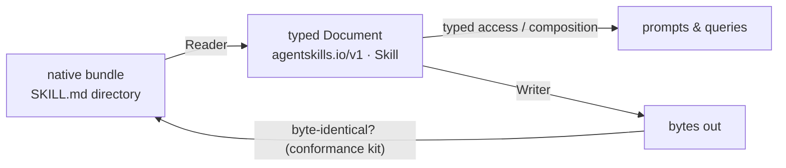

# Market fidelity

DNA's first rule of identity is that [**the owner names the
schema**](thesis.md#the-kubernetes-analogy). The practical consequence is
**market fidelity**: standards DNA did not invent are consumed *byte-faithful,
under their owners' namespaces* — no conversion, no lossy import into a
DNA-flavored copy.

## The rule

| Standard | apiVersion (owner) | Native bundle |
|---|---|---|
| Agent Skills | `agentskills.io/v1` | directory with `SKILL.md` (+ `scripts/`, `references/`) |
| Souls | `soulspec.org/v1` | `SOUL.md` + `IDENTITY.md` + `HEARTBEAT.md` (+ `soul.json`) |
| AGENTS.md | `agents.md/v1` | a plain `AGENTS.md` file |

A marketplace `SKILL.md` is read as `agentskills.io/v1 · Skill` and stored in
its own directory bundle exactly as its author wrote it. DNA gives you typed
access and composes it into prompts, but it never rewrites the file into a
DNA schema. When DNA writes it back, it comes back byte-identical.

The round-trip that guarantees it:

## Enforced, not aspirational

This is a test, not a promise. The [market-conformance
suite](../getting-started/conformance-kit.md) runs the full pipeline — scan →
typed access → prompt composition → write round-trip — against real
marketplace bundles copied verbatim:

- **31 real marketplace Skills** (Anthropic + community collections).
- The **`openai/codex` `AGENTS.md`**.
- The **soulspec starter templates**.

The write round-trip must return each bundle byte-identical. The live fixture
tree is
[`scopes/market-integration/`](https://github.com/ruinosus/dna/tree/main/scopes/market-integration);
provenance is recorded in
[`tests/market-fixtures/NOTICE.md`](https://github.com/ruinosus/dna/blob/main/tests/market-fixtures/NOTICE.md);
the suites are
[`test_market_conformance.py`](https://github.com/ruinosus/dna/blob/main/packages/sdk-py/tests/test_market_conformance.py)
and
[`test_market_conformance.py`](https://github.com/ruinosus/dna/blob/main/packages/sdk-py/tests/test_market_conformance.py).

## Why byte-faithful matters

If DNA imported a `SKILL.md` into its own schema, three things would break:

- **Round-trips would lose data.** Anything DNA's schema didn't model would
  be silently dropped on write.
- **Upgrades would fork.** When the upstream standard evolves, a translated
  copy drifts; a byte-faithful one just keeps working.
- **Trust would erode.** An author who publishes a Skill wants *their* Skill
  run, not a lossy re-interpretation of it.

Consuming the format under its owner's namespace sidesteps all three: the
standard's owner keeps the namespace and the format, and DNA is a faithful
reader of it. The round-trip fixpoint — the writer re-emits exactly what the
reader read — is the mechanical guarantee behind that trust (see [How to
write a Reader/Writer](../guides/readers-and-writers.md)).

## Where to go next

- [The thesis](thesis.md) — why "the owner names the schema" is rule one.
- [Running the conformance kit](../getting-started/conformance-kit.md) —
  prove byte-fidelity yourself.
- [How to write a Reader/Writer](../guides/readers-and-writers.md) — teach
  DNA a new format and keep the round-trip green.
