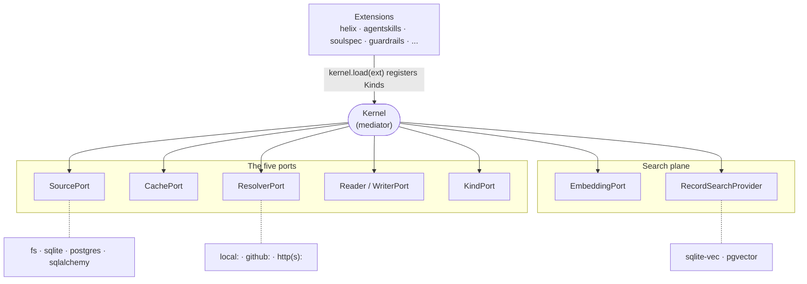

# The microkernel and its five ports

The runtime is a **microkernel**: a small, closed core that knows how to
store, validate, version and compose *documents* — but knows nothing about
any particular Kind. All Kind-specific knowledge is contributed by
**extensions** that plug into the kernel's ports.

This is the mechanism behind the thesis claim that [*the kernel knows no
Kinds*](thesis.md#5-the-kernel-knows-no-kinds).

## The kernel as a mediator over five ports

The kernel mediates five ports plus a hook registry. Each port answers one
question:

| Port | Question it answers |
|---|---|
| **SourcePort** | Where do manifests live? (filesystem, SQLite, Postgres) |
| **CachePort** | Where are installed dependencies cached? |
| **ResolverPort** | How are external dependencies fetched? (`local:`, `github:`, `http(s):`) |
| **Reader/WriterPort** | How is a bundle format detected, scanned and written back? (`SKILL.md`, `SOUL.md`, `AGENTS.md`, YAML) |
| **KindPort** | What is this Kind's identity, schema and composition role? |

The whole topology in one picture — extensions register Kinds on top, the
kernel mediates in the middle, adapters plug in underneath (the two
search-plane ports are covered in [Search & memory](search-and-memory.md)):

Because the core only ever talks to these interfaces, you can swap the
storage backend, the fetch strategy, or the on-disk format without touching
the composition logic — and you can add a Kind without touching the core at
all.

## Extensions register Kinds

`kernel.load(ext)` is the only wiring step. Each extension contributes one or
more `KindPort`s (and, for custom on-disk formats, a Reader and a Writer).
The kernel validates each registration at boot and fails loud on conflicts —
duplicate `(apiVersion, kind)` tuples, duplicate aliases, or a Reader/Writer
missing a required method.

Two ways to register a Kind, matching the [thesis rule that a Kind is
data](thesis.md#2-a-kind-is-data-not-a-class):

- **As data** — a record-style Kind with no custom behavior is a
  `*.kind.yaml` descriptor registered with `kind_from_descriptor()`. The
  descriptor files are byte-identical between the two SDKs and hash-enforced.
  No class, no code.
- **As code** — a Kind that needs a custom bundle format, a typed parse
  step, or a composition rule implements a `KindPort` class. See [How to add
  a Kind](../guides/add-a-kind.md).

## Dual SDK, one behavior

The Python (`packages/sdk-py`) and TypeScript (`packages/sdk-ts`) SDKs
implement this same kernel 1:1 — same ports, same composition rules, same
outputs. Parity is enforced by shared fixtures, descriptor hash checks, and a
kind-registry parity manifest that fails the suite on undocumented drift. The
public API differs only in casing convention: snake_case in Python
(`build_prompt`, `default_agent`), camelCase in TypeScript (`buildPrompt`,
`defaultAgent`).

## The port contract

A source adapter is only *production-ready* when it satisfies the port
contract — a suite that runs the same battery over every adapter and refuses
to let a claimed capability go unimplemented. The full contract, its
capability protocols, and the conformance kit for authoring a new adapter are
in [How to write a source adapter](../guides/write-a-source-adapter.md).

## Where to go next

- [Kinds — identity and composition](kinds.md) — what a `KindPort`
  contributes and how composition works.
- [How to add a Kind](../guides/add-a-kind.md) — register your own onto these
  ports.
- [How to write a source adapter](../guides/write-a-source-adapter.md) — the
  SourcePort contract in full.
