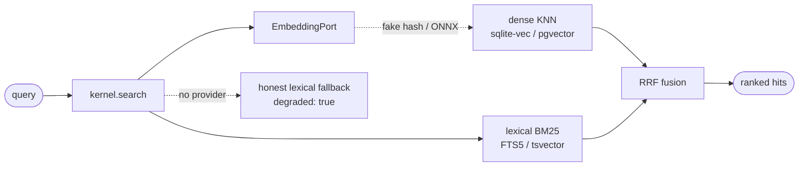
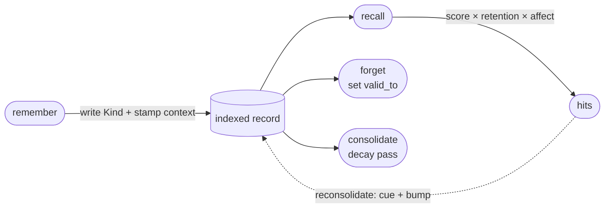

# Search & memory — recall without a server

DNA scopes are semantically searchable, and memory is a first-class verb set
over them — **entirely inside the SDK**. No vector database service, no
embeddings API, no background workers. One command shows the whole plane:

```console
$ dna recall "reciprocal rank fusion" --scope dna-development --kind Story -k 3

🔎 hybrid (dense+lexical+RRF) · scope=dna-development · 'reciprocal rank fusion'
   1. Story/s-search-pgvector  (0.0297)
      Adapter pgvector do RecordSearchProvider (escala) …
   ...
```

This page explains the model behind that line: two kernel ports, pluggable
adapters, an offline-first default, and a memory layer that is *not* a new
subsystem. For the hands-on recipe, see
[How to use semantic recall & memory](../guides/semantic-recall.md).

## Two ports, not a subsystem

The kernel knows nothing about vectors or SQL. Like
[the five core ports](microkernel-ports.md), search is mediated through
narrow protocols that adapters plug into
(`dna/kernel/protocols.py` · `src/kernel/protocols.ts`):

- **`EmbeddingPort`** — turn text into dense vectors. Contract:
  `embed(texts)` returns one vector per input, each of length `dims`, and
  `model_id` names the embedding space (vectors from different `model_id`s
  are **not** comparable). Register with `kernel.embedding_provider(...)`;
  consume via `kernel.embed(...)`.
- **`RecordSearchProvider`** — rank a scope's records against a query.
  Register with `kernel.record_search_provider(...)`; consume via
  `kernel.search(...)`. The guaranteed hit shape is
  `{scope, kind, name, score}` — anything extra (title, snippet) is optional.



One provider of each per kernel, wired at boot; registering again replaces.
The kernel core gains **zero** ML or database dependencies from any of this —
importing `dna` never pulls ONNX or sqlite-vec (import-isolation tests
guard it).

### Honest degradation

`kernel.search()` never raises and never fakes. With a provider registered it
returns hybrid similarity (`degraded: false`); with no provider — or a
provider error — it falls back to a token-match lexical scan and says so
(`degraded: true`). A caller can always tell which one it got. The same
honesty applies to embeddings: with no real provider, `kernel.embed()` uses a
deterministic hash-based fake (below) whose `model_id` marks it as its own,
non-semantic space.

## Offline-first, scale later

The default stack runs anywhere, with no network and no server:

| Plane | Default (offline floor) | Opt-in upgrade |
|---|---|---|
| Embeddings | `FakeEmbeddingProvider` — deterministic hash vectors, zero deps, bit-identical Py↔TS | ONNX all-MiniLM-L6-v2 (`embed-onnx` extra) — same artifact in `fastembed` (Py) and `transformers.js` (TS), lazy-downloaded on first embed |
| Store + search | sqlite-vec + FTS5 + RRF (`search-sqlite` extra) — one `.db` file per scope | Postgres + pgvector + tsvector (`search-pgvector` extra) — shared database, same contract |

Three deliberate choices in that table:

**The fake embedder is a floor, not a mock.** It feature-hashes the text
into a stable, unit-length 384-dim vector — the same input yields the bit-identical vector
in Python and TypeScript, by construction. It is *not* semantic (its
`model_id` is `dna-fake-hash-v1`, honestly incomparable with real spaces),
but it makes the entire search plane — indexing, KNN, fusion, tests —
runnable in CI with zero ML dependencies. Swap in the ONNX provider and
nothing else changes: same 384 dims, same port.

**sqlite-vec + FTS5 + RRF is full hybrid search in one file.** The dense
plane is a sqlite-vec KNN over `kernel.embed()` vectors; the lexical plane
is FTS5's BM25 over the same text; Reciprocal Rank Fusion merges the two
rankings using only ranks (raw cosine and BM25 scores are incomparable —
RRF sidesteps that entirely). The fusion is a single pure function shared by
every provider and both SDKs.

**pgvector is a scale adapter, not a different system.** Same port, same RRF
function, same overlay/tenant semantics — it swaps the one-file-per-scope
store for the Postgres that already backs the source plane. Both providers
pass the **same conformance suite**, so promoting from embedded to server is
a wiring change, not a rewrite.

## Memory is the Kinds you already have

DNA does not add a "memory store". Memory is the record Kinds the SDK
already ships — `LessonLearned`, `Research`, `Evidence` — written through
`kernel.write_document` and recalled through the same
`RecordSearchProvider` as everything else. Four verbs (`dna.memory` ·
`dna memory <verb>`) formalize the lifecycle:



- **`remember`** writes the Kind, stamps a deterministic encoding context and
  memory-type classification, seeds `valid_from`, and indexes it so a later
  recall finds it.
- **`recall`** runs hybrid search over the memory Kinds, drops invalidated
  memories, and re-ranks `LessonLearned` hits by
  `search score × retention × affect`. When a provider is available it also
  blends **embedding similarity into the ecphory ranking** (the cue and each
  candidate's semantic payload are embedded once; the cosine feeds the
  ecphory content score) and fuses the two rankings with the same RRF the
  search plane uses — so a memory phrased differently from the cue still
  surfaces. Auto by default (`--semantic/--no-semantic`); with no provider
  the ranking is exactly the base one, offline-first.
- **`forget`** *demotes*, never deletes (see bi-temporality below).
- **`consolidate`** is a deterministic decay pass: recompute retention,
  report — or with `--apply`, soft-forget — memories that have gone stale.

Three mechanics carry the cognitive weight, each simpler than it sounds:

**Ecphory** — a memory is retrieved by matching *cues*, and retrieval itself
reinforces it. Every recall appends the cue to the surfaced memory's
`cues_history` and nudges its confidence up (fail-soft, a light form of
reconsolidation). Memories you actually use get easier to find; the scoring
core is pure and deterministic (`dna.memory.ecphory`).

**Decay** — retention follows an Ebbinghaus-style curve: recall scores fade
with time since a memory was last reinforced, and `consolidate` uses the same
curve to flag memories whose retention fell below a floor. Nothing is
silently dropped — decay demotes ranking, and archiving is an explicit,
reported step.

**Bi-temporality** — every memory has world-time validity (`valid_from` /
`valid_to`) alongside record time. `forget` sets `valid_to` (optionally with
`superseded_by`) so the memory stops surfacing in recall — but the document
stays, auditable and revivable, and history can be reconstructed
point-in-time. Contradicted knowledge is *superseded*, not destroyed.

## What stays out of the SDK

The line is deterministic-vs-generative. Everything above — scoring, decay,
fusion, indexing, the verbs — is pure, deterministic, testable code in the
SDK. What the SDK deliberately does **not** include: LLM scribes that write
memories for you, schedulers/background workers that consolidate on a timer,
and any "deep sleep" pipeline. Those are host concerns — a service embedding
DNA can layer them on top of the verbs, but the SDK's contract stays
reproducible and offline.

This is the same positioning as
[agent-facing knowledge](agent-knowledge.md): memory is **curated, cited
Kinds with provenance** — `Research` findings carry evidence ratings,
`LessonLearned` carries its cues and validity window — recalled
deterministically, not prose regenerated and re-trusted on every run.

## Where to go next

- **Do it:** [How to use semantic recall & memory](../guides/semantic-recall.md)
  — install the extras, run the verbs, register providers programmatically.
- **Look it up:** the [`dna recall`](../reference/cli/recall.md) ·
  [`dna search`](../reference/cli/search.md) ·
  [`dna memory`](../reference/cli/memory.md) reference pages, and the
  [parity matrix](../reference/parity-matrix.md) for the Py↔TS surface.
