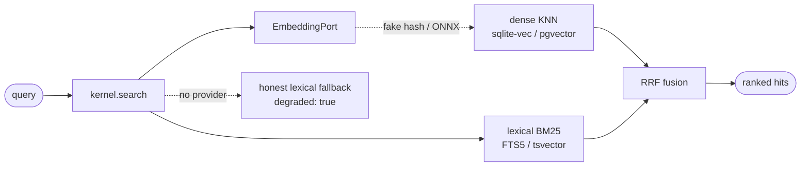
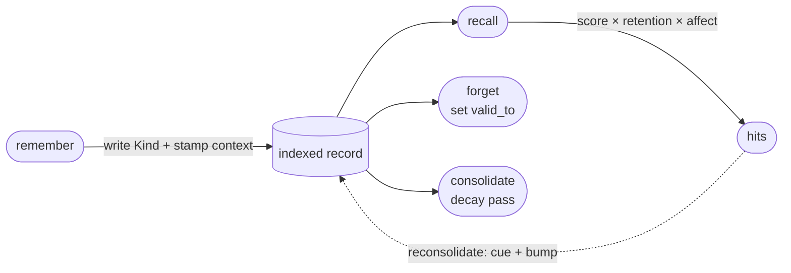

# Search & memory — recall without a server

DNA scopes are semantically searchable, and memory is a first-class verb set
over them — **entirely inside the SDK**. No vector database service, no
embeddings API, no background workers. One command shows the whole plane:

```console
$ dna recall "reciprocal rank fusion" --scope dna-development --kind Story -k 3

🔎 hybrid (dense+lexical+RRF) · scope=dna-development · 'reciprocal rank fusion'
   1. Story/s-search-pgvector  (0.0297)
      Adapter pgvector do RecordSearchProvider (escala) …
   ...
```

This page explains the model behind that line: two kernel ports, pluggable
adapters, an offline-first default, and a memory layer that is *not* a new
subsystem. For the hands-on recipe, see
[How to use semantic recall & memory](../guides/semantic-recall.md).

## Two ports, not a subsystem

The kernel knows nothing about vectors or SQL. Like
[the five core ports](microkernel-ports.md), search is mediated through
narrow protocols that adapters plug into
(`dna/kernel/protocols.py` · `src/kernel/protocols.ts`):

- **`EmbeddingPort`** — turn text into dense vectors. Contract:
  `embed(texts)` returns one vector per input, each of length `dims`, and
  `model_id` names the embedding space (vectors from different `model_id`s
  are **not** comparable). Register with `kernel.embedding_provider(...)`;
  consume via `kernel.embed(...)`.
- **`RecordSearchProvider`** — rank a scope's records against a query.
  Register with `kernel.record_search_provider(...)`; consume via
  `kernel.search(...)`. The guaranteed hit shape is
  `{scope, kind, name, score}` — anything extra (title, snippet) is optional.


```mermaid
flowchart LR
    Q([query]) --> K[kernel.search]
    K --> E[EmbeddingPort]
    E -.->|fake hash / ONNX| V[dense KNN<br/>sqlite-vec / pgvector]
    K --> L[lexical BM25<br/>FTS5 / tsvector]
    V --> R[RRF fusion]
    L --> R
    R --> H([ranked hits])
    K -.->|no provider| F[honest lexical fallback<br/>degraded: true]
```

One provider of each per kernel, wired at boot; registering again replaces.
The kernel core gains **zero** ML or database dependencies from any of this —
importing `dna` never pulls ONNX or sqlite-vec (import-isolation tests
guard it).

### Honest degradation

`kernel.search()` never raises and never fakes. With a provider registered it
returns hybrid similarity (`degraded: false`); with no provider — or a
provider error — it falls back to a token-match lexical scan and says so
(`degraded: true`). A caller can always tell which one it got. The same
honesty applies to embeddings: with no real provider, `kernel.embed()` uses a
deterministic hash-based fake (below) whose `model_id` marks it as its own,
non-semantic space.

## Offline-first, scale later

The default stack runs anywhere, with no network and no server:

| Plane | Default (offline floor) | Opt-in upgrade |
|---|---|---|
| Embeddings | `FakeEmbeddingProvider` — deterministic hash vectors, zero deps, bit-identical Py↔TS | ONNX all-MiniLM-L6-v2 (`embed-onnx` extra) — same artifact in `fastembed` (Py) and `transformers.js` (TS), lazy-downloaded on first embed |
| Store + search | sqlite-vec + FTS5 + RRF (`search-sqlite` extra) — one `.db` file per scope | Postgres + pgvector + tsvector (`search-pgvector` extra) — shared database, same contract |

Three deliberate choices in that table:

**The fake embedder is a floor, not a mock.** It feature-hashes the text
into a stable, unit-length 384-dim vector — the same input yields the bit-identical vector
by construction. It is *not* semantic (its
`model_id` is `dna-fake-hash-v1`, honestly incomparable with real spaces),
but it makes the entire search plane — indexing, KNN, fusion, tests —
runnable in CI with zero ML dependencies. Swap in the ONNX provider and
nothing else changes: same 384 dims, same port.

**sqlite-vec + FTS5 + RRF is full hybrid search in one file.** The dense
plane is a sqlite-vec KNN over `kernel.embed()` vectors; the lexical plane
is FTS5's BM25 over the same text; Reciprocal Rank Fusion merges the two
rankings using only ranks (raw cosine and BM25 scores are incomparable —
RRF sidesteps that entirely). The fusion is a single pure function shared by
every provider.

**pgvector is a scale adapter, not a different system.** Same port, same RRF
function, same overlay/tenant semantics — it swaps the one-file-per-scope
store for the Postgres that already backs the source plane. Both providers
pass the **same conformance suite**, so promoting from embedded to server is
a wiring change, not a rewrite.

## Memory is the Kinds you already have

DNA does not add a "memory store". Memory is the record Kinds the SDK
already ships — `Engram`, `Research`, `Evidence` — written through
`kernel.write_instance` and recalled through the same
`RecordSearchProvider` as everything else. Four verbs (`dna.memory` ·
`dna memory <verb>`) formalize the lifecycle:


```mermaid
flowchart LR
    W([remember]) -->|write Kind + stamp context| X[(indexed record)]
    X --> C([recall])
    C -->|"score × retention × affect"| H([hits])
    H -.->|reconsolidate: cue + bump| X
    X --> G([forget<br/>set valid_to])
    X --> D([consolidate<br/>decay pass])
```

- **`remember`** writes the Kind, stamps a deterministic encoding context and
  memory-type classification, seeds `valid_from`, and indexes it so a later
  recall finds it.
- **`recall`** runs hybrid search over the memory Kinds, drops invalidated
  memories, and re-ranks `Engram` hits by
  `search score × retention × affect`. When a provider is available it also
  blends **embedding similarity into the ecphory ranking** (the cue and each
  candidate's semantic payload are embedded once; the cosine feeds the
  ecphory content score) and fuses the two rankings with the same RRF the
  search plane uses — so a memory phrased differently from the cue still
  surfaces. Auto by default (`--semantic/--no-semantic`); with no provider
  the ranking is exactly the base one, offline-first.
- **`forget`** *demotes*, never deletes (see bi-temporality below) — and it is
  the **only** way to retire a memory. An `Engram` declares
  `record.invalidate-only`, so a hard delete is refused at the kernel and
  therefore at every door (the generic `delete_instance` tool,
  `DELETE /v1/memories/{name}`, the CLI), with the refusal naming `forget`.
  That refusal is what makes the bi-temporal guarantee below true rather than
  merely intended: until i-130 a generic delete removed the row *and its
  version history*, leaving an `as_of` read nothing to reconstruct from.
- **`consolidate`** is a deterministic decay pass: recompute retention,
  report — or with `--apply`, soft-forget — memories that have gone stale.
  `--dry-run` previews the whole pass with zero effect: one action per memory
  (`retain` / `expire` / `already_expired`, each with its deterministic
  reason) plus **merge candidates** — groups of lexically-overlapping
  memories with a proposed `supersede` fusion (keep the canonical, demote the
  rest). The fused-*text* synthesis stays outside the SDK by design: the
  `MergeScribe` seam (`dna.memory.merge`) is where an external LLM scribe
  plugs in.

Three mechanics carry the cognitive weight, each simpler than it sounds:

**Ecphory** — a memory is retrieved by matching *cues*, and retrieval itself
reinforces it. Every recall appends the cue to the surfaced memory's
`cues_history` and nudges its confidence up (fail-soft, a light form of
reconsolidation). Memories you actually use get easier to find; the scoring
core is pure and deterministic (`dna.memory.ecphory`).

**Decay** — retention follows an Ebbinghaus-style curve: recall scores fade
with time since a memory was last reinforced, and `consolidate` uses the same
curve to flag memories whose retention fell below a floor. Nothing is
silently dropped — decay demotes ranking, and archiving is an explicit,
reported step.

**Bi-temporality** — every memory runs on **two independent clocks**, and
keeping them apart is the point:

- **World time** — `valid_from` / `valid_to`: *when the fact was true*. `forget`
  sets `valid_to` (optionally with `superseded_by`) so the memory stops
  surfacing in recall, but the instance stays, auditable and revivable.
  Contradicted knowledge is *superseded*, not destroyed. `recall(now=…)` reads
  this axis.
- **Transaction time** — *when this system came to believe it*, taken from the
  version snapshot's `created_at`. `recall(as_of=…)` reads this axis, and it
  answers a different question: **"what did the system believe at T?"**

They come apart the moment something is recorded late or corrected. A note
written today about last year is **valid** last year and **believed** today: a
world-time read at last year finds it, a transaction-time read at last year must
not. Asking one when you meant the other is the classic bi-temporal mistake, and
no single "point-in-time" phrasing distinguishes them — which is exactly why the
two have separate parameters rather than one.

```bash
dna memory recall "postgres"                       # what we believe NOW
# the belief state, over REST — not the current one:
curl "$DNA_API/v1/memories/search?q=postgres&as_of=2026-08-01T12:00:00Z"
```

Two refusals keep the answer honest, both deliberate:

- a store that keeps **no version history** (the filesystem adapter) **refuses**
  an `as_of` read (HTTP 501) rather than serving the current state under a past
  timestamp;
- a memory whose history was **pruned** past `as_of` (record-plane Kinds cap
  retained versions — `VERSION_CHURN_RETENTION`) comes back named in
  `as_of_truncated`. "No record" is reported as a blind spot, never as "no
  memory".

An `as_of` recall also does **not** reconsolidate: a read of the past that writes
into the present is a contradiction.

## Contradiction — memories that disagree, presented rather than overwritten

Superseding a memory is something a caller *does*. Until `claims` existed,
nothing could *notice* that two memories the workspace believes right now say
opposite things — so a memory that was true when it was written kept being
recalled long after it stopped being true.

A memory may therefore declare what it asserts, structurally:

```bash
dna memory remember "O Kind Livro ainda precisa de aprovação." \
  --area KindDefinition/livro --claim approval=pending
dna memory remember "O Kind Livro foi aprovado no portal." \
  --area KindDefinition/livro --claim approval=approved

dna memory consolidate --dry-run   # ⚡ CONTRADICTION on KindDefinition/livro · approval
```

Two claims contradict when they **agree on subject and predicate, disagree on
object, and their `[valid_from, valid_to)` windows share an instant** — the
condition TOKI (arXiv:2606.06240 §2.1) states for bitemporal facts, which holds
for nine of Allen's thirteen base relations. The four it excludes matter as much
as the nine: a memory invalidated at exactly the instant its successor becomes
valid is a clean **succession**, and reporting that as a conflict would flag
every correctly superseded memory in the workspace.

Three properties are deliberate:

- **detection is syntactic** — three string comparisons and an interval test. No
  model is involved, and none can be: the SDK core stays deterministic. The
  optional `ContradictionScribe` is an *external* judge for the groups the rule
  leaves in `undecided`, the same seam shape as `MergeScribe`;
- **nothing is applied.** `consolidate(dry_run=True)` reports; `apply=True`
  still only expires stale memories and never resolves a disagreement. Each
  entry carries a `proposal` whose strategy is `await_confirmation` — a
  suggested survivor, for a human to accept or reject;
- **the suggestion is elected on transaction time**, not on the authored
  `created_at` (which a caller writes, and can therefore get wrong). Where the
  store pruned a memory's first version the stamp is only an upper bound, so it
  may decide by losing but never by winning — the proposal then falls back to
  the authored clock and names the bound in `recorded_at_approximate`.

This is the *opposite* of `merge_candidates`: that finds memories saying the
same thing twice (lexical overlap), this finds memories saying opposite things
once. Contradiction is therefore grouped only by **declared** referents — a
claim's `subject`, or the `Kind/name` the memory names in `area` /
`source_refs` — never by vocabulary, because two memories that disagree usually
share very few words.

## Personal vs workspace memory — the key is the person

By default a memory is **workspace** memory: it lives in the tenant partition of
the workspace the request resolved to, shared by that workspace's members — the
right default for collaboration. But there is a second, orthogonal axis:
**personal** memory, keyed not on the workspace but on the durable human identity
(the verified `oid`).

Every memory verb takes an explicit selector, `workspace` (the default — nothing
changes for existing calls) or `personal`:

```bash
dna memory remember "I always misread cron day-of-week" --personal   # private to me
dna memory recall  "cron" --personal
dna memory remember "our deploy runbook step 3" --area Feature/deploy  # workspace (default)
```

Over MCP the same choice is a `personal: true` flag on `recall`/`remember`; the
identity is read from the verified token. Offline (CLI/stdio) it is read from the
`DNA_PERSONAL_ID` environment variable. **The identity is always resolved
server-side — never a caller argument.** Without one, a personal request fails
closed (personal memory never lands in a blank, shared partition).

Personal memory is stored as a reserved value-namespace inside the *existing*
tenant partition — `personal:<oid>` — so there is **zero schema migration**: it
reuses the same filesystem path segment / Postgres tenant column that workspace
tenancy already uses. A personal recall unions your partition with the shared
base (`_lib`) defaults, and **nothing** from any workspace.

The consequence is the whole point: because the partition key is the *person*,
`personal:<oid>` is the **same** partition in workspace A, in workspace B, and in
a bare MCP client with no workspace at all. Workspace memory is portable across
clients but bounded to a workspace; personal memory is portable across clients
**and** across workspaces — it follows the identity itself. "Your memory follows
*you*" stops being a slogan and becomes a primary-key value.

**Privacy (INV-PERSONAL).** A personal memory written by identity X is never
readable by any other identity, nor by any workspace query — including a
workspace owner's or admin's. There is no override. This holds by four
independent layers: the `oid` is derived server-side (you cannot name another
identity's partition); a workspace read filters `tenant IN ('', <workspace_id>)`,
which provably cannot select a `personal:*` row; the `personal:` scheme is
reserved at the tenant validator, so no workspace can be named to alias a
personal partition; and a raw `tenant=personal:<victim>` override is rejected at
the surface. See the ADR (`docs/adr/ADR-personal-memory.md`) for the full model.

## What stays out of the SDK

The line is deterministic-vs-generative. Everything above — scoring, decay,
fusion, indexing, the verbs — is pure, deterministic, testable code in the
SDK. What the SDK deliberately does **not** include: LLM scribes that write
memories for you, schedulers/background workers that consolidate on a timer,
and any "deep sleep" pipeline. Those are host concerns — a service embedding
DNA can layer them on top of the verbs, but the SDK's contract stays
reproducible and offline.

This is the same positioning as
[agent-facing knowledge](agent-knowledge.md): memory is **curated, cited
Kinds with provenance** — `Research` findings carry evidence ratings,
`Engram` carries its cues and validity window — recalled
deterministically, not prose regenerated and re-trusted on every run.

## Where to go next

- **Do it:** [How to use semantic recall & memory](../guides/semantic-recall.md)
  — install the extras, run the verbs, register providers programmatically.
- **Look it up:** the [`dna recall`](../reference/cli/recall.md) ·
  [`dna search`](../reference/cli/search.md) ·
  [`dna memory`](../reference/cli/memory.md) reference pages, and the
  [Python API reference](../reference/python/index.md) for the surface.
