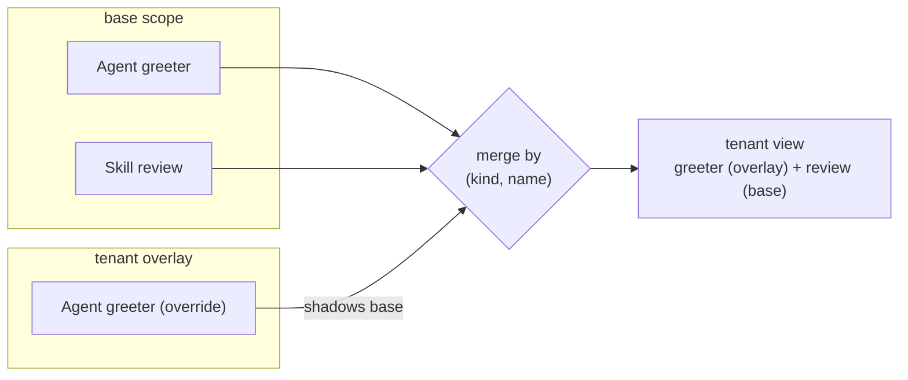

# Tenancy and layers

DNA separates *what a scope declares* from *who overrides it and how*. Two
orthogonal mechanisms do that work: **layers** (overlays that override a
base) and **tenants** (a first-class dimension for multi-tenant deployments).
A [`LayerPolicy`](#layerpolicy-which-layers-may-override-which-kinds) governs
which overrides are allowed.

This page is the conceptual overview. The mechanics of *storing* overlays
live in the source adapters — see [How to write a source
adapter](../guides/write-a-source-adapter.md).

## Scopes and the shared library

A **scope** is a directory of manifests — the unit you load with
`Kernel.quick(scope)`. Scopes are not islands: every scope can inherit shared
documents from a sibling `.dna/_lib/` **library scope**. Put an agent, skill
or theme in `_lib` and every scope sees it, unless the scope overrides it.

This is the base of the override model: `_lib` provides shared defaults; a
scope specialises them.

## Layers — overlays over a base

A **layer** is an overlay: a set of documents that override the base for some
dimension without editing the base. The base stays the shared product; a
layer carries only the *diffs*.

The canonical use is a **tenant overlay** — a per-tenant set of overrides
composed on top of the shared base at read time. The adapter resolves a
`load_layer(tenant)` view that merges the tenant's overrides over the base;
the base document is never mutated. A tenant that overrides nothing sees the
base unchanged.

The merge is by `(kind, name)` — an overlay document shadows its base twin,
everything else passes through:

## Tenants — a first-class dimension

Tenancy is **orthogonal to layers**, not a special case of them. DNA models
it with its own Kinds under the `tenant/v1` namespace:

| Kind | apiVersion | What it is |
|---|---|---|
| `Tenant` | `github.com/ruinosus/dna/tenant/v1` | A first-class tenant identity |
| `TenantMembership` | `github.com/ruinosus/dna/tenant/v1` | Who belongs to which tenant |
| `Workspace` | `github.com/ruinosus/dna/tenant/v1` | A named, collaborative tenancy space (alias `tenant-workspace`) |
| `WorkspaceMembership` | `github.com/ruinosus/dna/tenant/v1` | An identity's role in a `Workspace` (alias `tenant-workspace-membership`) |

Because tenant is a kernel dimension rather than a naming convention, a
tenant overlay for one scope does not leak into another — the base for a
scope belongs to that scope, and each tenant sees the base plus its own
diffs.

## Workspaces — collaborative, identity-based tenancy

A **`Workspace`** is a named tenancy space that is *decoupled* from any
external identity-provider tenant id. Where a `Tenant` keys the dimension to a
single organization, a `Workspace` is a first-class DNA space that people from
**different organizations** can share. The tenancy key the kernel resolves is
the workspace id — not the caller's home-org id.

A **`WorkspaceMembership`** maps a *verified identity* (its stable subject id
plus email) to a `Workspace` and a role. Membership — never the caller's
org id — decides what a request may read or write: every read/write is served
only if the authenticated identity holds an active membership in that
workspace, resolved before the source is touched. This is what lets a
workspace owner invite a collaborator from another organization by email; on
their first accepted sign-in the invite binds to their stable identity.

The two Kinds mirror `Tenant` / `TenantMembership`, but keyed on a
portable workspace id and a cross-organization identity rather than a single
org. A `Workspace` whose id equals a pre-existing tenant id inherits all of
that tenant's data with **zero migration** — the workspace simply becomes the
new name for the same rows.

### How the workspace is resolved (identity → membership)

The resolution is a pure, transport-agnostic policy (`dna.tenancy.resolution`,
with a 1:1 TypeScript twin — both driven by shared parity fixtures):

1. A verified token is distilled to an **identity** — the durable `oid`, the
   verified `email` (from `email` / `preferred_username` / `upn`), and the `tid`
   as *provenance only*. The `tid` is deliberately **not** the tenant.
2. The identity is matched against the `WorkspaceMembership` grants. An **active**
   grant matches on the durable `oid` once bound; while still unbound (a freshly
   seeded owner, or a not-yet-accepted invite that is already active) it matches
   on the **verified email**. A `pending` invite authorizes nothing.
3. The resolved workspace id is the tenancy key. A caller may *select* among the
   workspaces it belongs to (e.g. a per-workspace MCP URL), but the selector is
   re-verified against membership — a workspace the identity is not an active
   member of is denied. With no membership at all, the request is denied
   (fail-closed).

At the MCP edge this replaces the older "org id is the tenant" step. A source
that has **no `WorkspaceMembership` grants at all** has not opted into workspaces
(the OSS / self-host case) and keeps its prior single-tenant behaviour unchanged;
workspace resolution engages only once grants exist. Beneath the resolver, the
physical `(scope, tenant = workspace_id)` key gives defence in depth: a resolved
workspace defaults to — and may name — only its own scope, so even a bug upstream
cannot read another workspace's rows.

### Billing keys on the workspace

Plans attach to the **workspace**, not to an identity or an Azure org. A
[`WorkspacePlan`](../reference/kinds/record.md#workspaceplan) (`cloud-workspace-plan`)
maps a `workspace_id` to its current `Tier`; DNA Cloud's Stripe webhook writes it
(`PUT /v1/workspace-plan`), and the MCP quota guard reads it via
`kernel.workspace_plan(workspace_id)` — the same resolved workspace id the request
already keys on. Because the founding workspace's id equals the founder's old
organization id, a plan written for it keys on the *same* string as before, so the
switch to workspace-keyed billing is **zero migration**. (The pre-Model-B
`PUT /v1/tenant-plan` route remains as a deprecated alias that forwards its
`tenant` body to `workspace_id`, so an already-deployed webhook keeps working.)

## LayerPolicy — which layers may override which Kinds

Not every Kind should be overridable by every layer. A **`LayerPolicy`**
(`github.com/ruinosus/dna/policy/v1 · LayerPolicy`) declares *which layers may
override which Kinds* — the guardrail on the override model. It is data, like
everything else: a policy document, validated and versioned.

## The maxim: inheritable ⇒ never per-tenant-only

A design invariant worth stating plainly: a Kind that is an **inheritable
default** — one a scope inherits from `_lib` and may override — must be
writable at the shared base. Reading such a Kind promises a base default that
overlays can specialise; a storage mode that forbids writing that base would
contradict the read contract. So inheritable Kinds use a **permissive** or
**global** tenancy model, never a strictly per-tenant one. Per-tenant-only
storage is reserved for data that has *no* shared default (audit logs, per-user
profiles, and the like).

## Where to go next

- [The microkernel and its five ports](microkernel-ports.md) — where source
  adapters (and their layer support) plug in.
- [How to write a source adapter](../guides/write-a-source-adapter.md) — the
  per-tenant overlay capability in the port contract.
- [Kinds](kinds.md) — the identity model these dimensions apply to.
