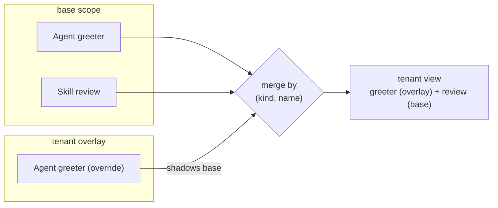

# Tenancy and layers

DNA separates *what a scope declares* from *who overrides it and how*. Two
orthogonal mechanisms do that work: **layers** (overlays that override a
base) and **tenants** (a first-class dimension for multi-tenant deployments).
A [`LayerPolicy`](#layerpolicy-which-layers-may-override-which-kinds) governs
which overrides are allowed.

This page is the conceptual overview. The mechanics of *storing* overlays
live in the source adapters — see [How to write a source
adapter](../guides/write-a-source-adapter.md).

## Scopes and the shared library

A **scope** is a directory of manifests — the unit you load with
`Kernel.quick(scope)`. Scopes are not islands: every scope can inherit shared
documents from a sibling `.dna/_lib/` **library scope**. Put an agent, skill
or theme in `_lib` and every scope sees it, unless the scope overrides it.

This is the base of the override model: `_lib` provides shared defaults; a
scope specialises them.

## Layers — overlays over a base

A **layer** is an overlay: a set of documents that override the base for some
dimension without editing the base. The base stays the shared product; a
layer carries only the *diffs*.

The canonical use is a **tenant overlay** — a per-tenant set of overrides
composed on top of the shared base at read time. The adapter resolves a
`load_layer(tenant)` view that merges the tenant's overrides over the base;
the base document is never mutated. A tenant that overrides nothing sees the
base unchanged.

The merge is by `(kind, name)` — an overlay document shadows its base twin,
everything else passes through:

## Tenants — a first-class dimension

Tenancy is **orthogonal to layers**, not a special case of them. DNA models
it with its own Kinds under the `tenant/v1` namespace:

| Kind | apiVersion | What it is |
|---|---|---|
| `Tenant` | `github.com/ruinosus/dna/tenant/v1` | A first-class tenant identity |
| `TenantMembership` | `github.com/ruinosus/dna/tenant/v1` | Who belongs to which tenant |
| `Workspace` | `github.com/ruinosus/dna/tenant/v1` | A named, collaborative tenancy space (alias `tenant-workspace`) |
| `WorkspaceMembership` | `github.com/ruinosus/dna/tenant/v1` | An identity's role in a `Workspace` (alias `tenant-workspace-membership`) |

Because tenant is a kernel dimension rather than a naming convention, a
tenant overlay for one scope does not leak into another — the base for a
scope belongs to that scope, and each tenant sees the base plus its own
diffs.

## Workspaces — collaborative, identity-based tenancy

A **`Workspace`** is a named tenancy space that is *decoupled* from any
external identity-provider tenant id. Where a `Tenant` keys the dimension to a
single organization, a `Workspace` is a first-class DNA space that people from
**different organizations** can share. The tenancy key the kernel resolves is
the workspace id — not the caller's home-org id.

A **`WorkspaceMembership`** maps a *verified identity* (its stable subject id
plus email) to a `Workspace` and a role. Membership — never the caller's
org id — decides what a request may read or write: every read/write is served
only if the authenticated identity holds an *active* membership in that
workspace, resolved before the source is touched. An active grant may exist
*before* its holder ever signs in — this is exactly how both the zero-migration
founder seed and a **cross-organization invite** work: the grant is created
*unbound* (email only) and binds to the holder's stable `oid` on their first
verified sign-in (see [Invites](#invites-the-cross-org-join) below).

The two Kinds mirror `Tenant` / `TenantMembership`, but keyed on a
portable workspace id and a cross-organization identity rather than a single
org. A `Workspace` whose id equals a pre-existing tenant id inherits all of
that tenant's data with **zero migration** — the workspace simply becomes the
new name for the same rows.

### How the workspace is resolved (identity → membership)

The resolution is a pure, transport-agnostic policy (`dna.tenancy.resolution`,
with a 1:1 TypeScript twin — both driven by shared parity fixtures):

1. A verified token is distilled to an **identity** — the durable `oid`, the
   verified `email` (from `email` / `preferred_username` / `upn`), and the `tid`
   as *provenance only*. The `tid` is deliberately **not** the tenant.
2. The identity is matched against the `WorkspaceMembership` grants. An **active**
   grant matches on the durable `oid` once bound; while still unbound (a freshly
   seeded owner, or a not-yet-accepted invite that is already active) it matches
   on the **verified email**. A `pending` invite authorizes nothing.
3. The resolved workspace id is the tenancy key. A caller may *select* among the
   workspaces it belongs to (e.g. a per-workspace MCP URL), but the selector is
   re-verified against membership — a workspace the identity is not an active
   member of is denied. With no membership at all, the request is denied
   (fail-closed).

At the MCP edge this replaces the older "org id is the tenant" step. A source
that has **no `WorkspaceMembership` grants at all** has not opted into workspaces
(the OSS / self-host case) and keeps its prior single-tenant behaviour unchanged;
workspace resolution engages only once grants exist. Beneath the resolver, the
physical `(scope, tenant = workspace_id)` key gives defence in depth: a resolved
workspace defaults to — and may name — only its own scope, so even a bug upstream
cannot read another workspace's rows.

### Billing keys on the account, not the workspace

**The subscription belongs to the billing account.** An
[`PlanBinding`](../reference/kinds/record.md#planbinding) (`cloud-plan-binding`)
maps an `account_id` to its current `PricingPlan`, and that one assignment covers *every*
workspace the account owns — creating a second workspace is not a second charge.
DNA Cloud's Stripe webhook writes it (`PUT /v1/account-plan`); the MCP quota guard
resolves **workspace → `account_id` → plan**, taking the account from the
`Workspace` doc the request already keys on.

Access and billing are therefore two different axes, deliberately. Access is
resolved by *membership* (you see a workspace because you were granted it);
billing is resolved by *ownership* (a workspace is paid for by the account that
created it). Collapsing them is what made the previous per-workspace model
unworkable: enumerating "the account's workspaces" through membership sweeps in
every workspace somebody else founded and invited you into, and paying for those
would hand a tier to an account that never bought one.

`Workspace.account_id` is stamped once, at creation, from the caller's verified
claims (`dna.tenancy.account_id_from_claims`). **An account is an organization or
a person, and both can be sold to:**

* **organization** — whatever the IdP block's `tenant_claim` names (Entra `tid`,
  WorkOS/Clerk/Auth0 `org_id`, Google Workspace `hd`);
* **person** — when the sign-in belongs to no organization (the consumer lane),
  the identity's durable `sub`. Before this, such a sign-in resolved to no
  account at all: permanent Free with no way to buy, which is not a plan for a
  product whose wedge is an individual story.

The id is **namespaced by provider and by account kind** — `entra-org:<tid>`,
`workos-org:<org_id>`, `workos-user:`, and the same `-org`/`-user` pair for
`clerk`, `auth0` and `google`; `tenant:<value>` when the provider cannot be
named. This buys exactly two things: a `tid` and a `sub` that happen to share a
literal value can never be the same account, and an id read in a Stripe record or
a support ticket says what kind of account it is. **The prefix is not a parsing
surface** — nothing branches on it to decide authorization or entitlement; the
authorization input is the verified claim, never a substring of an id DNA minted.

Entra has no person lane on purpose: its `sub` is *pairwise* (unique per user
*per application*), so the same human presents a different `sub` to a different
app registration. Its durable id is `oid`, but making a personal Microsoft
account billable is a separate product decision — so the shared-MSA tenant
(`9188040d-…`, which *every* personal Microsoft account presents as its `tid`)
stays refused outright rather than becoming one giant shared account.

A workspace with no resolvable account falls to the **Free floor**: fail-closed,
never another account's tier. There is deliberately no rule that treats an
account-less workspace as its own account — that would resurrect per-workspace
billing as a silent default.

(The per-workspace `PUT /v1/workspace-plan` route and its `WorkspacePlan` Kind
were retired; the Kind remains a write-block tombstone so a stale caller fails
loudly instead of writing docs nothing reads.)

### Picking a workspace by URL (`/w/<id>/mcp`)

An MCP client (VS Code) connects with only a bearer token — there is no
interactive picker. It selects its workspace **by URL**: the per-workspace
endpoint `https://…/w/<workspace-id>/mcp` names the workspace in the path, while
the bare `…/mcp` falls back to the identity's sole / default membership. The
path is only ever a *selector*: the auth bridge reads `<workspace-id>` from it and
**re-verifies** it against membership (a non-member is denied), so the workspace
is a named, verified claim — never trusted blind. The REST face has the mirror
mechanism: under `--auth config` a verified bearer JWT is resolved to a workspace
by membership, and that workspace **overwrites** the request's `tenant` argument
(a caller can no longer forge it).

## Invites — the cross-org join

The point of workspaces is collaboration *across* organizations. A workspace
Owner or Admin invites a person from **any** org **by email**, and that person's
first verified sign-in joins them — the GitHub/Slack shape.

1. **Invite.** An Owner/Admin creates a `WorkspaceMembership` with `status:
   pending`, `identity_email` set to the invited address, and `identity_oid`
   *null* — no account has to exist yet. Only an Owner/Admin of *that* workspace
   may invite, and only an Owner may invite another Owner.
2. **Accept (bind on first sign-in).** The invitee authenticates from their own
   org. The server matches the token's **verified** email claim against the
   pending invite, **binds** the durable `oid` (recording the `tid` as
   provenance), and flips `status: active`. Email is the *handle*; `oid` is the
   *key*.

The accept step is impersonation-proof by construction:

- Matching is only ever on a **verified** email claim (Entra's
  `email`+`email_verified`, or the verified `preferred_username`/`upn` UPN) — never
  a caller-supplied field. An unverified email accepts nothing (fail-closed).
- The bind key is the durable `oid`. Once a grant is bound, it matches *only* on
  that `oid` — so a different identity that later controls the same email can
  **not** hijack the membership. A token with no `oid` binds nothing.
- The whole decision is the pure `dna.tenancy.invites` policy (with a 1:1
  TypeScript twin, driven by shared parity fixtures), so both runtimes agree.

REST endpoints expose the flow: `POST /v1/workspaces/{id}/invites` (Owner/Admin),
`GET /v1/workspaces/{id}/members` (Owner/Admin), and `POST /v1/workspaces/accept`
(the verified invitee). The accept route is exempt from the workspace bind — an
invitee is still `pending` and by definition holds no active membership yet.

### Shipped, and what's still roadmap

The Model-B workspace stack above is **shipped and live** end to end:
`Workspace` + `WorkspaceMembership` and the zero-migration seed (F1);
membership-decides-access resolution (F2); `PlanBinding` billing (F4); and the
cross-org invite flow plus `/w/<id>/mcp` URL selection (F3). Every claim on this
page traces to merged code in the DNA SDK.

The one piece still **on the roadmap** is the end-user *console* for it: the DNA
Cloud **portal invite UI** (the buttons that call `POST /v1/workspaces/{id}/invites`
and surface the member list) lives in the hosted product, not this SDK. The DNA
side — the Kinds, the resolution/invite policies, the REST endpoints — is done;
the portal screens that drive them are tracked separately in DNA Cloud.

## LayerPolicy — which layers may override which Kinds

Not every Kind should be overridable by every layer. A **`LayerPolicy`**
(`github.com/ruinosus/dna/policy/v1 · LayerPolicy`) declares *which layers may
override which Kinds* — the guardrail on the override model. It is data, like
everything else: a policy document, validated and versioned.

## The maxim: inheritable ⇒ never per-tenant-only

A design invariant worth stating plainly: a Kind that is an **inheritable
default** — one a scope inherits from `_lib` and may override — must be
writable at the shared base. Reading such a Kind promises a base default that
overlays can specialise; a storage mode that forbids writing that base would
contradict the read contract. So inheritable Kinds use a **permissive** or
**global** tenancy model, never a strictly per-tenant one. Per-tenant-only
storage is reserved for data that has *no* shared default (audit logs, per-user
profiles, and the like).

## Where to go next

- [The microkernel and its five ports](microkernel-ports.md) — where source
  adapters (and their layer support) plug in.
- [How to write a source adapter](../guides/write-a-source-adapter.md) — the
  per-tenant overlay capability in the port contract.
- [Kinds](kinds.md) — the identity model these dimensions apply to.
