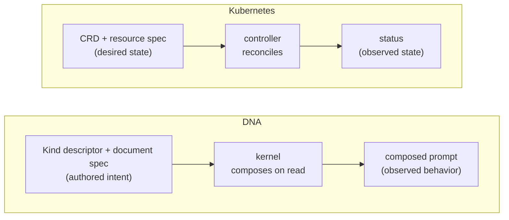

# The thesis — CRDs, but for agentic behavior

DNA is a declarative, typed notation for everything that participates in an
agentic system — agents, skills, souls, guardrails, tools, policies. This
page is the **primer**: it states the idea normatively, then teaches it.

It is written in two layers, after the pattern the
[CloudEvents](https://github.com/cloudevents/spec) project uses for its own
spec and primer:

- **[Normative core](#normative-core)** — short, precise, RFC-2119. What it
  *means* for something to be a Kind in DNA. If you implement or extend DNA,
  this is the contract.
- **[The primer](#the-primer)** — longer, teaching. Where the idea comes
  from, the Kubernetes analogy that anchors it, and exactly where that
  analogy holds and where it bends.

> The key words **MUST**, **MUST NOT**, **SHOULD**, **SHOULD NOT**, and
> **MAY** in the normative core are to be interpreted as described in
> [RFC 2119](https://www.rfc-editor.org/rfc/rfc2119).

---

## Normative core

### 1. Identity

1. Every document **MUST** be identified by the pair `(apiVersion, kind)`.
2. The `apiVersion` **MUST** be a namespace that identifies **who owns the
   schema** for that Kind — not merely a version counter.
3. A Kind that DNA did not invent **MUST** be carried under its owner's
   namespace, unchanged. A Skill is `agentskills.io/v1 · Skill`; a Soul is
   `soulspec.org/v1 · Soul`; an `AGENTS.md` is `agents.md/v1 ·
   AgentDefinition`. Only Kinds DNA invents **MAY** live under
   `github.com/ruinosus/dna/…`.

### 2. A Kind is data, not a class

4. A Kind **MUST** be describable as data. A record-style Kind — one with no
   custom composition behavior — **MUST** be registrable from a
   `*.kind.yaml` descriptor alone, with no code.
5. A descriptor that defines the same Kind **MUST** produce the same
   registration in every DNA runtime. In this repository the Python and
   TypeScript descriptor files are byte-identical and hash-checked.
6. A Kind **MAY** supply code (a `KindPort`) when — and only when — it needs
   behavior the data model cannot express: a custom bundle format, a
   composition rule, a typed parse step.

### 3. Behavior is authored, not compiled

7. A document's `spec` **MUST** be the authored intent — the desired
   behavior — and nothing else. It is the part a human writes and reviews.
8. Observed behavior — the composed system prompt, the resolved layer
   overlay, the runtime effect — **MUST** be **derived** by the runtime from
   the `spec` at read time. It **MUST NOT** be hand-written into the
   document.
9. Changing behavior **MUST** be expressible as an edit to a document.
   It **MUST NOT** require rebuilding or redeploying the software that runs
   the agent.

### 4. Validation and composition

10. A document **MUST** validate against its Kind's schema on write. An
    invalid document **MUST** be rejected at the boundary, not silently
    accepted.
11. Composition (agent + soul + skills + guardrails → one system prompt)
    **MUST** happen on read, driven by the Kinds involved — never by
    kind-specific branches hardcoded into the runtime.

### 5. The kernel knows no Kinds

12. The runtime kernel **MUST NOT** hardcode any Kind name, schema, or
    composition rule. Kinds **MUST** be contributed by extensions that
    register onto the kernel's ports.
13. Adding a Kind to your own domain **MUST NOT** require forking DNA or
    landing an upstream change. A descriptor file or a small extension is
    the whole of it.

Everything below teaches *why* these hold.

---

## The primer

### The one-sentence version

**Kubernetes CRDs, but for agentic behavior.**

If you have never met a Kubernetes Custom Resource Definition, skip ahead to
[Behavior is data](#behavior-is-data-not-code) — the idea stands on its own.
If you have, the analogy is the fastest way in.

### The Kubernetes analogy

Kubernetes does not know what a `Deployment` is in any special, wired-in
way. It knows how to store, validate, version and reconcile *resources*, and
a `Deployment` is just one resource type registered against that machinery.
Anyone can register a new one — a **Custom Resource Definition** — and from
that moment the API server stores it, validates it against its schema, and
controllers reconcile it, with **no change to Kubernetes itself**. The type
system is open; the core is closed to hardcoded knowledge of any single
type.

Two properties of that design are the ones DNA borrows:

- **The API group names the owner.** In `apps/v1 · Deployment`, the
  `apps/v1` group tells you who owns the schema. A resource travels with its
  owner's namespace; consumers read it as-is instead of translating it into
  a local shape. DNA's `apiVersion` is exactly this. `agentskills.io/v1 ·
  Skill` says *this schema belongs to the Agent Skills standard* — so DNA
  reads a marketplace `SKILL.md` **byte-faithful**, never importing it into
  a DNA-flavored copy. (See [Market fidelity](market-fidelity.md).)

- **`spec` is intent; the observed state is derived.** A Kubernetes
  resource carries a `spec` (what you want) and a `status` (what is
  actually true), and you only ever write the `spec`. The `status` is
  computed by a controller and written back for you — hand-editing it is a
  category error.

Side by side, the two pipelines mirror each other:



### spec is intent; behavior is the observed state

DNA takes the second property literally.

A DNA document's `spec` is **author intent** — the behavior you declare and
review in git:

```yaml
apiVersion: github.com/ruinosus/dna/v1
kind: Agent
metadata:
  name: greeter
spec:
  instruction: "You are Helio, a friendly assistant."
  soul: helio                 # a reference, not an inlined copy
  skills: [verification-before-completion]
```

Nothing in that document is a *composed prompt*. It does not contain the
soul's personality text, or the skill's instructions, or the final system
message an LLM will see. Those are the **observed state** — and, exactly as
with a CRD's `status`, they are **derived by the runtime**, never
hand-written:

```
mi.build_prompt(agent="greeter")
  → resolves spec.soul → the Soul "helio"
  → resolves spec.skills → the Skill bundles
  → runs the composition template
  → one system prompt   ← the observed state
```

The kernel is the controller. The `spec` is the desired state you author;
the composed prompt is the observed state it reconciles into, on read. You
never write the second one down, the same way you never write a
`Deployment`'s `status.availableReplicas` by hand.

This is why "iterating on an agent is a file edit, not a deploy" is a
*consequence*, not a slogan: if observed behavior is always derived from the
authored `spec`, then changing behavior can only ever mean editing the
`spec`.

### Where the analogy bends — an honest accounting

Good docs say where a mental model stops helping:

- **No live control loop.** A Kubernetes controller runs continuously,
  reconciling toward desired state. DNA's "reconciliation" is a pure
  function evaluated on read — `build_prompt` composes; there is no daemon
  watching for drift. The *shape* of the idea (author intent → derived
  observed state) maps cleanly; the *continuous loop* does not.
- **`status` is not a stored subresource.** DNA does not persist a `status`
  block. The observed state is the composition output and the resolved layer
  view — computed, returned, and thrown away, not written back into the
  document. That is deliberate: the only durable truth is the authored
  intent in git.
- **Scope, not namespaces.** CRDs are `Namespaced` or `Cluster`-scoped. DNA
  has *scopes* (a directory of manifests) and an orthogonal *tenant*
  dimension with *layer* overlays. Related in spirit, different in
  mechanics — see [Tenancy and layers](tenancy-layers.md).

Take the analogy for the two things it gets right — **the owner names the
schema**, and **intent is authored while behavior is derived** — and drop it
at the edges.

### Behavior is data, not code

The deepest claim is the smallest to state: **the things that decide how an
agent behaves are data, not code.**

Prompts, skill wiring, personas, guardrails, composition rules — in most
systems these are strings and branches compiled into an application. In DNA
they are versioned YAML/Markdown documents. The SDK validates them on write
(per-Kind JSON Schema) and composes them on read. The software that *runs*
the agent never has to change for the agent's behavior to change.

And because behavior is data, a new Kind of behavior is a new *kind of
data* — a descriptor file — not a new class:

```yaml
# a record-style Kind, defined entirely as data
apiVersion: github.com/ruinosus/dna/core/v1
kind: KindDefinition
metadata:
  name: playbook
spec:
  apiVersion: acme.example/v1
  kind: Playbook
  storage: { pattern: yaml, container: playbooks }
  schema: { type: object, required: [steps], properties: { steps: { type: array } } }
```

No fork of DNA, no upstream pull request, no `kind == "Playbook"` branch
anywhere in the kernel. The kernel stays closed to hardcoded knowledge of
any Kind; your type system stays open. That is the CRD bargain, applied to
agentic behavior.

### Where to go next

- [Kinds — the identity and composition model](kinds.md) — how `(apiVersion,
  kind)`, `dep_filters` and templates turn references into a composed prompt.
- [The microkernel and its five ports](microkernel-ports.md) — the closed
  core that knows no Kinds.
- [Market fidelity](market-fidelity.md) — how "the owner names the schema"
  is enforced against real marketplace bundles, not just asserted.
- [Your first Kind](../getting-started/first-kind.md) — the thesis as ten
  minutes of runnable code, Python and TypeScript side by side.
