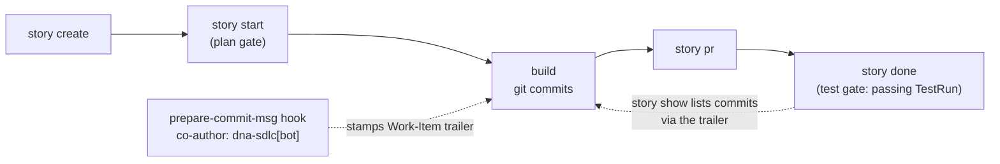

# Your git log is your SDLC

DNA tracks its own software lifecycle **as DNA documents**. This repository's
Stories, Features and Issues live in
[`.dna/dna-development/`](https://github.com/ruinosus/dna/tree/main/.dna/dna-development) —
the repo *is* the project, so its scope sits at the root, right where the
CLI's default source `./.dna` resolves. This is the SDLC methodology as a
first-class, dogfooded pillar: the trail from idea to shipped commit is
itself declarative data.

The loop end to end: a Story is created, started through a **plan gate**
(`story start` refuses to run without `--plan`/`--plan-doc`/`--plan-file`),
built with stamped commits, and closed by `story done` — whose **test gate**
refuses to close without a passing TestRun (escape hatch: `--allow-no-tests`,
recorded as an exception). The `dna-sdlc[bot]` identity co-signs every commit
born under a Story:



## The git side: stamped commits

The loop is closed by a versioned `prepare-commit-msg` hook:

```bash
dna sdlc hooks install        # one-time per clone → git config core.hooksPath scripts/git-hooks
dna sdlc story start s-my-story --plan "..."
git commit -m "feat: the actual work"   # ← stamped automatically
```

While a Story is active (`.dna/active-story.txt`, written by `story start`),
every commit is stamped with two trailers — a machine-readable link to the
work item, and the **dna sdlc tool identity** as co-author (a provenance
seal: *this commit was born under story governance — it has a plan, a
timeline, a test gate*; override via `DNA_SDLC_COAUTHOR`):

```
commit 3f2a9c1…
Author: You <you@example.com>

    feat(cli): stamp Work-Item trailers on commit

    Work-Item: Story/s-my-story
    Co-Authored-By: dna-sdlc[bot] <dna-sdlc[bot]@users.noreply.github.com>
```

No active Story → no stamp: absence is signal too. Merges, squashes and
amends are never rewritten.

## The way back needs no bookkeeping

Because the link is in the commit trailer, tracing a Story's work is a `git
log` query — nothing to maintain:

```bash
dna sdlc story show s-my-story      # lists commits via git log --grep "Work-Item: Story/s-my-story"
dna sdlc story commits s-my-story   # merges that with commits recorded in the Story timeline
dna sdlc hooks status               # shows the wiring
dna sdlc hooks uninstall            # reverts to .git/hooks
```

!!! warning "hooks install claims the hooks path"

    `install` makes `scripts/git-hooks/` the clone's *only* hooks dir — keep
    personal hooks there too, or wire the script by hand.

## The same convention signs pull requests

Just as some coding agents sign the PRs they generate, DNA signs the PRs born
from its Stories:

```bash
dna sdlc story pr s-my-story          # gh pr create, pre-filled FROM the story
dna sdlc story pr s-my-story --dry-run   # print title + body, no gh call
dna sdlc pr-footer s-my-story         # just the footer, for hand-made PRs
```

`story pr` assembles the whole PR from the Story document — title
`feat(<first-label>): <story title> (<s-my-story>)`, body = the story
description plus the acceptance criteria as a task-list checklist, and the
attribution footer at the end (override the line via `$DNA_SDLC_PR_FOOTER`):

```markdown
---
🧬 Tracked with DNA SDLC — Work-Item: Story/s-my-story
```

`--base` / `--head` / `--draft` pass through to `gh`; on success the PR URL
is stamped back onto the Story timeline (`pr_opened`). The PR is born from
the story, not the other way around — and when it squash-merges, the landed
commit carries the `Work-Item:` trailer, so `story show` lists it with zero
bookkeeping.

## Agent-ready

The repo is agent-ready:
[`AGENTS.md`](https://github.com/ruinosus/dna/blob/main/AGENTS.md) is the
entry point for any coding agent — and a live `agents.md/v1` instance the SDK
itself parses. Claude Code users get the `dna-sdlc-cli` skill via the bundled
plugin (`.claude-plugin/marketplace.json`).

## Related

- [Agent-facing knowledge](../concepts/agent-knowledge.md) — why DNA
  represents knowledge (including the SDLC timeline) as curated, cited Kinds
  rather than generated prose.
