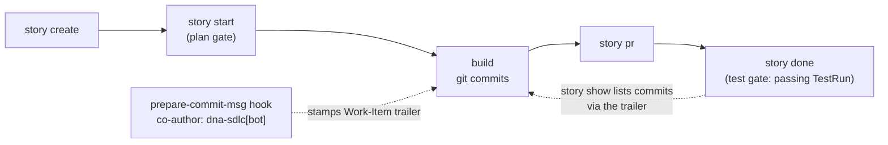

# Your git log is your SDLC

DNA tracks its own software lifecycle **as DNA documents**. This repository's
Stories, Features and Issues live in
[`.dna/dna-development/`](https://github.com/ruinosus/dna/tree/main/.dna/dna-development) —
the repo *is* the project, so its scope sits at the root, right where the
CLI's default source `./.dna` resolves. This is the SDLC methodology as a
first-class, dogfooded pillar: the trail from idea to shipped commit is
itself declarative data.

**Which scope do the verbs hit?** Every `dna sdlc` verb resolves its
scope with one documented precedence — no need to repeat `--scope` in an
adopter repo whose board scope has its own name (`foundry-dev`, ...):

1. `--scope` flag — always wins;
2. env `DNA_SDLC_SCOPE`;
3. auto-detection — when the source holds exactly **one** scope with SDLC
   structure (a `stories/`, `features/`, `epics/`, `issues/` or
   `roadmaps/` container), that scope is used (the CLI logs the choice
   to stderr);
4. fallback `dna-development` (this repo's own board — compat).

The loop end to end: a Story is created, started through a **plan gate**
(`story start` refuses to run without `--plan`/`--plan-doc`/`--plan-file`),
built with stamped commits, and closed by `story done` — whose **test gate**
refuses to close without a passing TestRun (escape hatch: `--allow-no-tests`,
recorded as an exception). The `dna-sdlc[bot]` identity co-signs every commit
born under a Story:



## The git side: stamped commits

The loop is closed by a versioned `prepare-commit-msg` hook:

```bash
dna sdlc hooks install        # one-time per clone → git config core.hooksPath scripts/git-hooks
dna sdlc story start s-my-story --plan "..."
git commit -m "feat: the actual work"   # ← stamped automatically
```

While a Story is active (`.dna/active-story.txt`, written by `story start`),
every commit is stamped with two trailers — a machine-readable link to the
work item, and the **dna sdlc tool identity** as co-author (a provenance
seal: *this commit was born under story governance — it has a plan, a
timeline, a test gate*; override via `DNA_SDLC_COAUTHOR`):

```
commit 3f2a9c1…
Author: You <you@example.com>

    feat(cli): stamp Work-Item trailers on commit

    Work-Item: Story/s-my-story
    Co-Authored-By: dna-sdlc[bot] <dna-sdlc[bot]@users.noreply.github.com>
```

No active Story → no stamp: absence is signal too. Merges, squashes and
amends are never rewritten.

## The way back needs no bookkeeping

Because the link is in the commit trailer, tracing a Story's work is a `git
log` query — nothing to maintain:

```bash
dna sdlc story show s-my-story      # lists commits via git log --grep "Work-Item: Story/s-my-story"
dna sdlc story commits s-my-story   # merges that with commits recorded in the Story timeline
dna sdlc hooks status               # shows the wiring
dna sdlc hooks uninstall            # reverts to .git/hooks
```

!!! warning "hooks install claims the hooks path"

    `install` makes `scripts/git-hooks/` the clone's *only* hooks dir — keep
    personal hooks there too, or wire the script by hand.

## The same convention signs pull requests

Just as some coding agents sign the PRs they generate, DNA signs the PRs born
from its Stories:

```bash
dna sdlc story pr s-my-story          # gh pr create, pre-filled FROM the story
dna sdlc story pr s-my-story --dry-run   # print title + body, no gh call
dna sdlc pr-footer s-my-story         # just the footer, for hand-made PRs
```

`story pr` assembles the whole PR from the Story document — title
`feat(<first-label>): <story title> (<s-my-story>)`, body = the story
description plus the acceptance criteria as a task-list checklist, and the
attribution footer at the end (override the line via `$DNA_SDLC_PR_FOOTER`):

```markdown
---
🧬 Tracked with DNA SDLC — Work-Item: Story/s-my-story
```

`--base` / `--head` / `--draft` pass through to `gh`; on success the PR URL
is stamped back onto the Story timeline (`pr_opened`). The PR is born from
the story, not the other way around — and when it squash-merges, the landed
commit carries the `Work-Item:` trailer, so `story show` lists it with zero
bookkeeping.

## The triangle closes: GitHub Issues, bridged with provenance

GitHub Issues are artifacts of the github.com domain — DNA **bridges** to
them, it does not replace them. Commits carry the `Work-Item:` trailer, PRs
carry the 🧬 footer, and issues complete the triangle with the same
attribution plus explicit provenance fields on the Issue document
(`github_number`, `github_url`, `github_state`, `github_synced_at` — all on
the Issue Kind schema, so the write path validates them):

```bash
dna sdlc issue publish i-007-my-bug        # gh issue create, born FROM the doc
dna sdlc issue publish i-007-my-bug --dry-run   # print title + body, no gh call
dna sdlc issue import "#42"                # GitHub issue → Issue doc
dna sdlc issue import https://github.com/owner/repo/issues/42
dna sdlc issue sync i-007-my-bug           # refresh github_state from the remote
```

`publish` assembles the GitHub issue from the document — title
`<title> (<i-007-my-bug>)`, body = description + type/severity + a link back
to the doc on the board + the same 🧬 footer PRs carry — then stamps the
GitHub number/URL back onto the doc. It is idempotent: publishing an
already-bridged Issue just prints its link. `import` goes the other way:
the doc gets a board-convention name (`i-NNN-gh42-<title-slug>`), labels map
to `type`/`severity` by a deliberately simple heuristic
(`bug`/`regression` → bug, `enhancement`/`feature` → enhancement,
`question` → question, anything doc/chore-shaped → task;
`critical`/`p0` → critical, `p1` → high, `minor`/`p3` → low, default
medium), and the GitHub author becomes the `reporter`.

The sync is deliberately **light**, and honest about degradation:

- `dna sdlc issue resolve` on a bridged Issue also closes the GitHub twin
  with a comment (`gh issue close --comment`) — best-effort: no `gh`, no
  auth, no network → the local resolve still lands and you get a warning,
  never a failure.
- `issue sync` refreshes `github_state`; an issue closed on the GitHub side
  leaves a note on the local timeline instead of silently flipping the local
  status — whether "closed there" means "resolved here" is a triage
  decision, not a heuristic.
- `--repo owner/name` defaults to the `origin` remote of the enclosing
  repo; `publish`/`import` without a usable `gh` fail with a didactic
  message, not a traceback.

## Work items produce artifacts

A work item is a **hub**: a Story, Feature, Epic or Spike can point at the
outputs it produced — of any Kind — through its `produces[]` list. Attach one
with:

```bash
dna sdlc produces add Epic/e-dna-dx HtmlArtifact/ha-e-dna-dx-design --role design-doc
dna sdlc produces list Epic/e-dna-dx        # resolved outputs (produces[] ∪ legacy back-refs)
```

One of the Kinds you can attach is the **`HtmlArtifact`** — an HTML page stored
as a first-class, linkable output. It is a bundle: `ARTIFACT.html` holds the raw
markup **byte-faithful** (the writer never injects frontmatter or re-escapes, so
a design doc, roteiro or rendered report survives the round-trip untouched), plus
an optional `artifact.json` companion carrying structured metadata (`title`,
`description`, `source`, `created_at`) — the same shape as a Soul's
`SOUL.md` + `soul.json`. Create one straight from a file:

```bash
dna sdlc artifact create ha-e-dna-dx-design --from design.html \
    --title "DNA DX — Agora → Depois" \
    --description "Antes/depois da DX do DNA." \
    --source "design doc do épico e-dna-dx"
dna sdlc artifact list                       # what's stored in the scope
dna sdlc artifact show ha-e-dna-dx-design    # metadata (or --html to dump the page)
```

DNA dogfoods this itself: the `e-dna-dx` epic **produces** its own design doc as
the `HtmlArtifact/ha-e-dna-dx-design` above — so the "why" of the work is
traceable on the board, not lost in a chat transcript.

## Agent-ready

The repo is agent-ready:
[`AGENTS.md`](https://github.com/ruinosus/dna/blob/main/AGENTS.md) is the
entry point for any coding agent — and a live `agents.md/v1` instance the SDK
itself parses. Claude Code users get the `dna-sdlc-cli` skill via the bundled
plugin (`.claude-plugin/marketplace.json`).

## Related

- [Digest — what happened while you were away](sdlc-digest.md) — the
  retrospective mirror of `brief`/`next`/`current`: for when you delegated the
  work and review the timeline at the end.
- [Agent-facing knowledge](../concepts/agent-knowledge.md) — why DNA
  represents knowledge (including the SDLC timeline) as curated, cited Kinds
  rather than generated prose.
