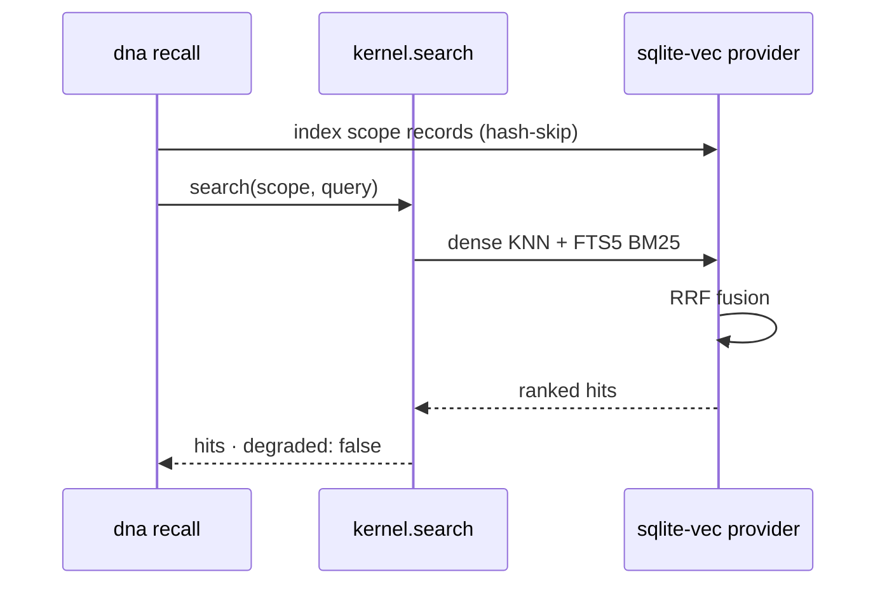

# How to use semantic recall & memory

Search a scope semantically and give an agent durable memory — offline, no
server. This is the task recipe; the model behind it is in
[Search & memory](../concepts/search-and-memory.md), and every flag is in the
[`dna recall`](../reference/cli/recall.md) /
[`dna search`](../reference/cli/search.md) /
[`dna memory`](../reference/cli/memory.md) reference.

All outputs below are real runs against
[`examples/hello-genome`](https://github.com/ruinosus/dna/tree/main/examples/hello-genome)
and this repo's own scope.

## 1. Install the extra

Semantic search is an opt-in extra — the core SDK never drags vector or ML
dependencies:

```bash
pip install "dna-sdk[search-sqlite]"    # sqlite-vec + FTS5 + RRF (the embeddable default)
pip install "dna-sdk[embed-onnx]"       # optional: real ONNX embeddings (all-MiniLM-L6-v2)
pip install "dna-sdk[search-pgvector]"  # optional: Postgres + pgvector, for scale
```

!!! note "Working from the repo (pre-1.0)"
    The packages are not on PyPI yet. From a clone, the `dev` extra already
    includes `search-sqlite`:
    `cd packages/sdk-py && uv venv && uv pip install -e ".[dev]" -e ../cli`.

## 2. Search a scope: `dna recall`

`dna recall` registers the sqlite-vec provider, indexes the scope's records
on demand (idempotent — re-runs skip unchanged docs by text hash), and runs a
hybrid dense + lexical + RRF search:

```console
$ dna recall "friendly assistant" --scope hello-genome --kind Agent -k 3

🔎 hybrid (dense+lexical+RRF) · scope=hello-genome · 'friendly assistant'
   1. Agent/greeter  (0.0328)
      greeter You are Helio, a friendly assistant. Greet people warmly and answer…
```

`dna search` is the same command under a neutral name. Useful knobs:
`--kind` (repeatable) restricts kinds, `--tenant` searches base ∪ overlay
(overlay shadows base), `--json` emits machine-readable hits. The index
lives in a `.dna-search/` directory beside your `.dna/` (override with
`DNA_SEARCH_DIR`).

What one search does end to end:



### Without the extra: honest degradation

Search is a read — it never raises on a missing dependency. Without
`search-sqlite` you get the kernel's lexical token scan, clearly labeled:

```console
$ dna recall "friendly assistant" --scope hello-genome --kind Agent -k 3
⚠ search-sqlite extra not installed — degrading to lexical scan (pip install 'dna-sdk[search-sqlite]' for semantic recall)

🔎 lexical (degraded) · scope=hello-genome · 'friendly assistant'
   1. Agent/greeter  (0.5000)
```

Same query, same top hit here — but the lexical scan only matches tokens, so
paraphrased queries ("how do I welcome users") will miss what hybrid search
finds.

## 3. Give an agent memory: `dna memory`

Memory is the record Kinds you already have (`LessonLearned`, `Research`,
`Evidence`) plus four verbs. Write one:

```console
$ dna memory remember "Always deep-copy a doc's spec before mutating — the cache hands back a shared reference" \
    --scope hello-genome --area Feature/kernel --affect regret \
    --reason "Mutating the cached dict in place corrupted every later read in the same process" \
    --tag cache

🧠 remembered LessonLearned/rem-5d60593f38
   Always deep-copy a doc's spec before mutating — the cache hands back a shared reference
```

That wrote a plain `LessonLearned` YAML into the scope (deterministically
enriched: encoding context, memory type, `valid_from`) and indexed it.
Recall it — hits are re-ranked by search score × Ebbinghaus retention ×
affect, and each surfaced memory gets its cue recorded:

```console
$ dna memory recall "cache mutation" --scope hello-genome

🧠 recall · hybrid (dense+lexical+RRF) · scope=hello-genome · 'cache mutation'
   1. LessonLearned/rem-5d60593f38  (0.0426)  [retention 1.00]
      rem-5d60593f38 Always deep-copy a doc's spec before mutating — the cache hands back…
```

### Recall by paraphrase: the semantic blend

Recall has a second, additive ranking plane. When the provider is available,
`dna memory recall` also embeds the cue and each candidate's *semantic
payload* (`area`/`title`/`summary`/`body` — the same fields the ecphory
scoring reads; names, dates and affect labels never dilute the similarity),
feeds the cosine into the deterministic ecphory ranking, and fuses the two
rankings with the same RRF the search plane uses. A memory phrased
differently from your cue — no shared phrase, no token-subset match — can
still surface, and the hits say why:

```console
$ dna memory recall "mutating documents safely" --scope hello-genome -k 2

🧠 recall · hybrid (dense+lexical+RRF) + semantic (ecphory×cosine) · scope=hello-genome · 'mutating documents safely'
   1. LessonLearned/rem-5d60593f38  (0.0328)  [retention 1.00]  [cos 0.44]
      rem-5d60593f38 Always deep-copy a doc's spec before mutating — the cache hands back…
```

`--semantic/--no-semantic` controls the blend; the default is **auto** — on
exactly when the provider is available, so without the extra the behavior
(and every score) is unchanged. In JSON output, fused hits carry
`rank_recall` / `rank_ecphory` / `score_recall` / `semantic` (the cosine) so
you can see both rankings.

Memories written *before* the provider existed (or on a machine without the
local `.dna-search/` store) are not a migration problem: every recall
lazy-backfills the index first (`dna.memory.backfill_index` — idempotent by
text hash, unchanged docs are never re-embedded).

Forgetting is bi-temporal demotion — the document stays, auditable, but
stops surfacing:

```console
$ dna memory forget rem-5d60593f38 --scope hello-genome
🕯  forgotten: LessonLearned/rem-5d60593f38 (valid_to=2026-07-09T20:59:11+00:00)
   (retained + auditable — bi-temporal invalidation, not deleted)

$ dna memory recall "cache mutation" --scope hello-genome

🧠 recall · hybrid (dense+lexical+RRF) · scope=hello-genome · 'cache mutation'
  (no memories)

$ dna memory list --scope hello-genome --all
name            state      affect  area            summary
--------------  ---------  ------  --------------  ------------------------------------------------------------
rem-5d60593f38  forgotten  regret  Feature/kernel  Always deep-copy a doc's spec before mutating — the cache ha
```

And `consolidate` is the deterministic maintenance pass — recompute
retention, report stale memories (soft-forget them with `--apply`):

```console
$ dna memory consolidate --scope hello-genome

🌙 consolidate · evaluated 0 · 0 stale · archived 0
```

## 4. Register providers programmatically

The CLI (and the MCP server — see §5) wire the sqlite-vec provider **and**,
when the `embed-onnx` extra is installed, the local ONNX embedder for you — so
`dna recall` is genuinely semantic offline the moment both extras are present.
In your own code you register them on the kernel once, at boot. This script is
runnable as-is next to a `.dna/` directory:

```python
import asyncio

from dna import Kernel
from dna.adapters.filesystem.writable import FilesystemWritableSource
from dna.adapters.search.sqlite_vec import (
    SqliteVecRecordSearchProvider,
    document_text,
)

SCOPE = "hello-genome"


async def main() -> None:
    kernel = Kernel.auto(source=FilesystemWritableSource(".dna"))

    # 1. Register the provider (one per kernel; boot-time wiring).
    provider = SqliteVecRecordSearchProvider(kernel, db_dir=".dna-search")
    kernel.record_search_provider(provider)

    # 2. Index the records you want searchable (idempotent by text hash).
    records = []
    async for raw in kernel.query(SCOPE, "Agent"):
        name = raw["metadata"]["name"]
        records.append({
            "scope": SCOPE, "kind": "Agent", "name": name,
            "tenant": "", "text": document_text(raw), "title": name,
        })
    await provider.index(records)

    # 3. Search — hybrid now, honest lexical fallback if the provider errors.
    res = await kernel.search(SCOPE, "friendly assistant", k=3)
    print("degraded:", res["degraded"])
    for hit in res["hits"]:
        print(f"  {hit['kind']}/{hit['name']}  {hit['score']:.4f}")


asyncio.run(main())
```

```text
degraded: False
  Agent/greeter  0.0328
```

The memory verbs are the same surface one level up —
`from dna.memory import remember, recall, forget, consolidate` — each an
async function taking `(kernel, scope, ...)`.

### Embeddings: the floor and the real thing

With no embedding provider registered, `kernel.embed()` uses the
deterministic hash-based fake — zero dependencies, bit-identical between
Python and TypeScript, honest about not being semantic:

```python
kernel = Kernel.auto()
print("model:", kernel.embedding_model_id, "| dims:", kernel.embedding_dims)
[vec] = await kernel.embed(["reciprocal rank fusion"])
print("non-zero dims:", sum(1 for v in vec if v))
```

```text
model: dna-fake-hash-v1 | dims: 384
non-zero dims: 3
```

For real semantic similarity, install the `embed-onnx` extra and register the
ONNX provider — same 384 dims, so the swap changes nothing downstream. The
model artifact is lazy-downloaded and cached on the first `embed()` call
(never at install or import time):

```python
from dna.adapters.embedding.onnx import OnnxEmbeddingProvider

kernel.embedding_provider(OnnxEmbeddingProvider())  # all-MiniLM-L6-v2
```

Rebuild the index after swapping providers: vectors from different
`model_id`s are not comparable, so the store pins its embedding space and
**refuses** to open under a different `(model_id, dims)` rather than mix
them silently. Delete the `.dna-search/` store and re-index.

### Scaling up: pgvector

When one file per scope stops being enough, the `search-pgvector` extra
provides `PgVecRecordSearchProvider` — same port, same RRF, same conformance
suite, backed by the Postgres you already run for the source plane:

```python
from dna.adapters.search.pgvector import PgVecRecordSearchProvider

provider = PgVecRecordSearchProvider(kernel, dsn="postgresql://dna@localhost/dna")
kernel.record_search_provider(provider)
```

Nothing else in your code changes — that is the point of the port.

### Prove your stack: the memory conformance kit

Whatever combination you assemble — custom source, custom provider, custom
embedder — the SDK ships a public battery that certifies the memory verbs
over it: `memory_conformance_suite` (the verb lifecycle, capability-aware)
and `memory_scoring_conformance_suite` / `memoryScoringConformanceSuite`
(the pure scoring core, Py↔TS twinned). See [Running the conformance
kit](../getting-started/conformance-kit.md#the-memory-conformance-kit).

## 5. Enable local semantic recall in the MCP server

The MCP server exposes memory as the `remember` / `recall` tools (and reads
through the same kernel the `dna` CLI does). Its boot path registers the search
provider and the embedder from the **same** choke point as the CLI, so enabling
offline semantic recall for it is purely a matter of installing the two local
extras into the environment the server runs from — no code change, no external
API, no network at query time.

```bash
# into the venv the `dna` binary resolves from (`which dna`):
pip install "dna-sdk[search-sqlite]"   # sqlite-vec: the vector + FTS5 + RRF search plane
pip install "dna-sdk[embed-onnx]"      # fastembed/onnxruntime: real local embeddings
# from a clone: uv pip install 'sqlite-vec>=0.1.6' 'fastembed>=0.3'
```

That is the whole enable step. With both extras present the server, on boot,
registers `SqliteVecRecordSearchProvider` (so `recall` is provider-backed, not
the lexical fallback) and `OnnxEmbeddingProvider` (all-MiniLM-L6-v2, so the
dense plane is real paraphrase similarity instead of the deterministic
fake-hash floor). The ONNX model artifact is fetched and cached on the first
embed (the Chroma pattern) — never an external API on the query path.

### Verify it end to end

Boot a server against a scope and drive it with any MCP client:

```bash
dna mcp serve --transport http --port 8010 --auth none --base-dir ./path/to/.dna
```

**Before** (neither extra installed — the honest degraded floor):

```json
remember → { "kind": "LessonLearned", "name": "rem-…", "indexed": false }
recall   → { "semantic": false, "degraded": true,  "hits": [ … ] }
```

`indexed:false` because no search provider is registered; `recall` degrades to
the kernel's lexical token scan (`degraded:true`), and the semantic plane is
off (`semantic:false`).

**After** (both extras installed):

```json
remember → { "kind": "LessonLearned", "name": "rem-…", "indexed": true }
recall   → { "semantic": true, "degraded": false, "hits": [ … ] }
```

A paraphrased cue that shares no tokens with the stored memory now surfaces it
as the top hit — e.g. recalling *"how does foliage make food from solar
radiation"* returns a memory whose summary is *"Plants convert sunlight into
chemical energy stored in glucose"* (`semantic:true`, `degraded:false`), which
the fake-hash floor cannot do (its cosine for that pair is ~0).

!!! note "Why both extras"
    `search-sqlite` alone already flips `indexed`/`semantic` to `true` — but the
    dense plane then runs on the fake-hash floor, which is orthogonal for a
    paraphrase (cosine ≈ 0), so `semantic:true` would be lexical-in-disguise.
    Adding `embed-onnx` makes the dense plane genuinely semantic. The server
    registers the ONNX embedder automatically when the extra is present; it
    never clobbers an embedder you wired explicitly (via config or code).

## TypeScript

The TS SDK ships the same surface: `kernel.embed` / `kernel.search`, the
bit-identical fake embedder, `SqliteVecRecordSearchProvider`
(`sqlite-vec` as an optional peer dependency), and
`OnnxEmbeddingProvider` (`@huggingface/transformers` as an optional peer
dependency, same ONNX artifact as Python). See the
[parity matrix](../reference/parity-matrix.md) for the exact Py↔TS mapping.
