# Data model (MER)

!!! info "Generated from source — do not edit"

    Emitted by `scripts/gen_data_model_docs.py` from the live
    `Kernel.auto()` registry and the SQLAlchemy table model.
    `scripts/data_model_guard.py` fails CI when this page and a
    fresh regeneration disagree. Edit the generator, never this file.

DNA's data model has two levels. The **logical** model — Kinds and
the references between them — carries the meaning. The **physical**
model is a generic document store that tells you almost nothing about
the domain, and this page says so rather than dressing it up.

## One database, four schema owners

A MER showing only the SDK's tables and stopping there misleads by
omission. **A single Postgres instance is shared by four independent
schema owners**, each migrating only its own tables:

| Owner | Migrates | On this page |
| --- | --- | --- |
| DNA SDK (this repo) | the document-store tables below, via its own Alembic tree | yes — fully |
| dna-cloud portal | its Prisma schema (accounts, plans, billing — real relational tables with real foreign keys) | **no** — separate repo, separate migration tool |
| Copilot service | `copilot_thread` and friends | **no** |
| LangGraph runtime | `checkpoint*` / `store*` | **no** |

The SDK's Alembic run is explicitly told not to have opinions about
tables it does not own — otherwise autogenerate would propose
dropping another owner's data. That exclusion list is machine-
readable, so it is reproduced from source rather than asserted:

| Excluded from the SDK's autogenerate |
| --- |
| `alembic_version` |
| `dna_schema_migrations` |
| `dna_search_docs` |
| `dna_search_meta` |
| `dna_search_migrations` |
| `schema_migrations` |
| `search_docs` |
| `search_fts` |
| `search_meta` |
| `search_vec` |
| `sqlite_sequence` |

## Logical model — Kinds and their references

76 Kinds are registered. Each is a document, not a table: a
Kind costs a YAML descriptor and zero migrations, which is the point
of an open type system. The cost is that references between Kinds are
not database foreign keys — they are fields holding a name.

### How to read the edges

Not every line here is equally trustworthy, and pretending otherwise
would be the whole problem. Four tiers, strongest first:

| Tier | Drawn | What it means |
| --- | --- | --- |
| **Declared** | solid | The field carries `x-dna-ref`. The kernel resolves it at write time — the only tier the system enforces. |
| **Composition** (`dep`) | solid | `dep_filters` names the target Kind. A real declaration, but it drives prompt composition and is never checked against stored data. |
| **Inferred** | dashed | Nothing declares it; the field NAME resolves to a Kind. A convention, not a contract. |
| **Unresolved** | not drawn | Reference-shaped, no confident target. Tabulated below. |

`*` on a label marks a polymorphic reference (several possible target Kinds).

**113 edges: 15 declared, 66 composition-only, 32 inferred** — plus 16 reference-shaped fields left unresolved and 6 known-undeclarable ones.

!!! warning "Only the declared tier cannot dangle"

    `dep_filters` declares a target *Kind*; nothing validates the
    *value*. A `Feature.owner` naming an Actor that does not exist is
    written without complaint. Solid therefore means "the model knows
    what this points at", not "this resolves". Closing that gap is
    what `x-dna-ref` does, one field at a time.

### Overview — how the groups reference each other

Kinds are grouped by alias prefix (`sdlc-`, `helix-`, …) — a grouping
that comes from the data. Arrows are counts of edges between groups;
self-references are omitted here and shown in the detail diagrams.

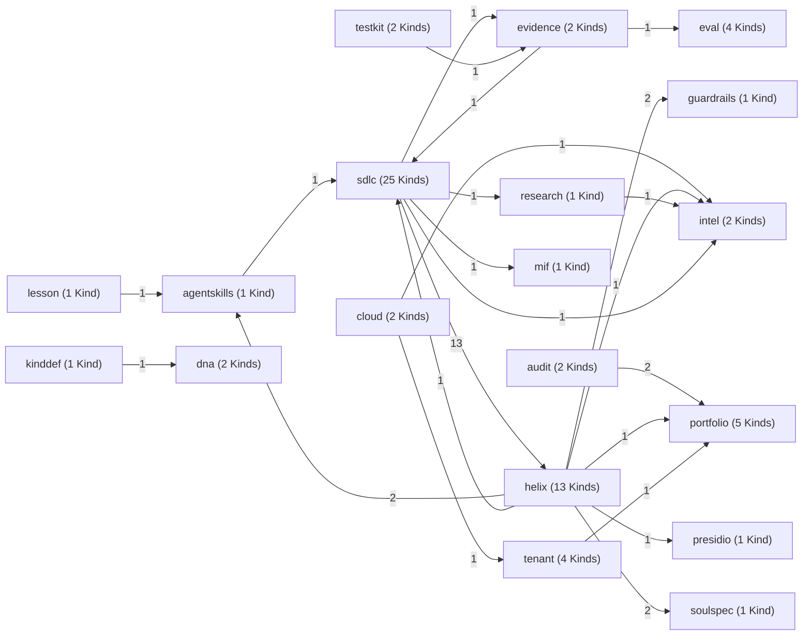

### Detail by group

All 76 Kinds in one diagram is an unreadable hairball, so
each group with at least 2 edges gets its
own. A group carrying more than 20 edges is
split again by tier, which keeps the enforced edges legible instead
of losing them among the unvalidated ones. A box from another group
appearing here is a cross-group reference.

#### `audit` (2 edges)

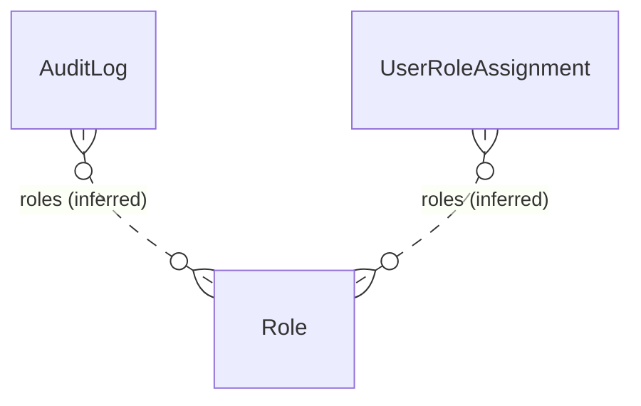

#### `cloud` (3 edges)

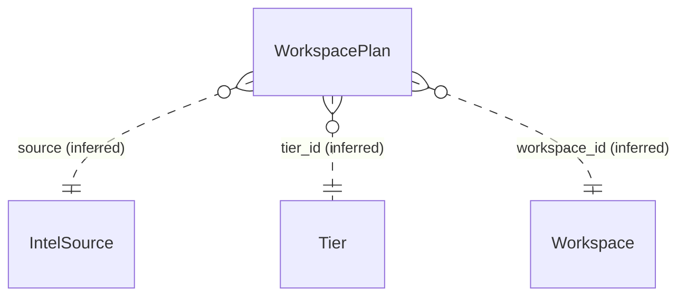

#### `eval` (3 edges)

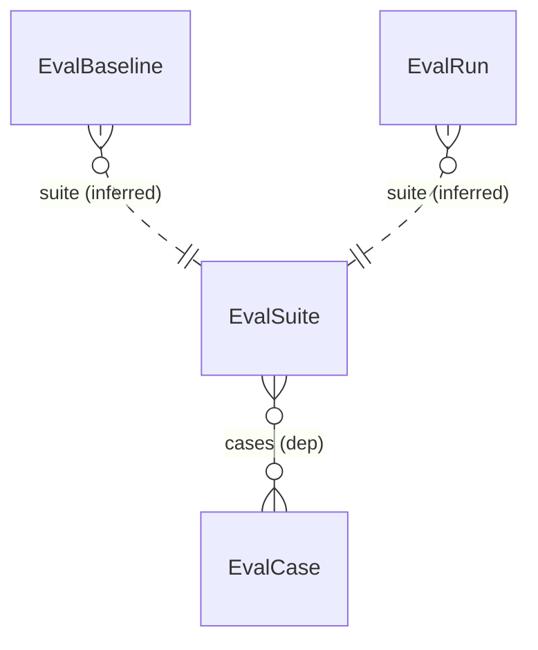

#### `evidence` (2 edges)

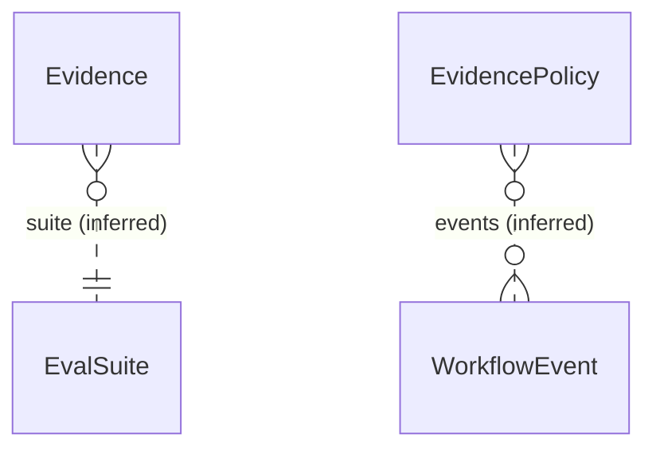

#### `helix` (16 edges)

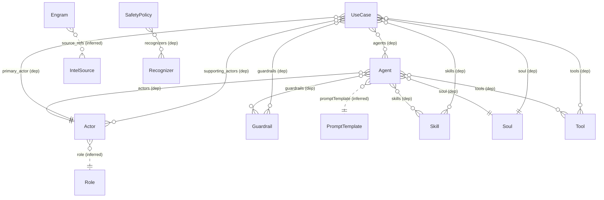

#### `portfolio` (4 edges)

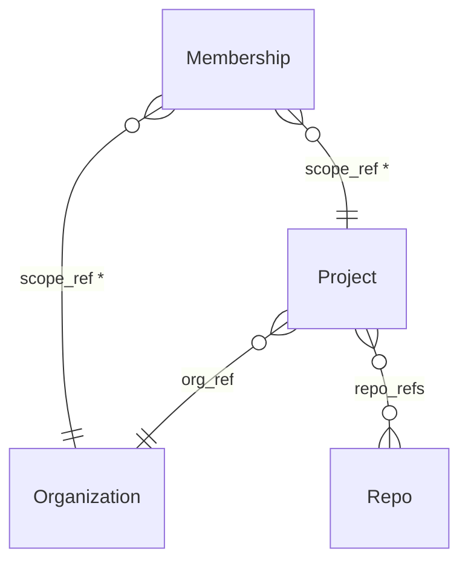

#### `sdlc` — declared (11 edges)

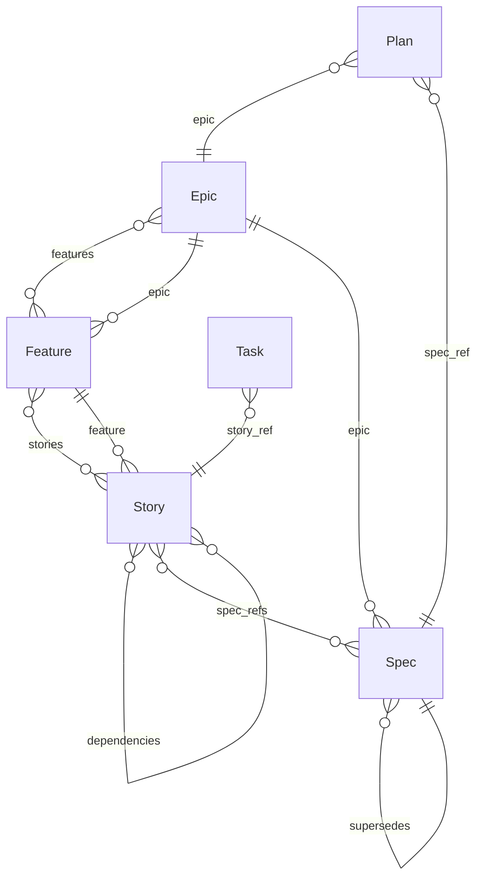

#### `sdlc` — composition (52 edges)

```mermaid
erDiagram
    ADR
    Actor
    AgentSession
    Bug
    Epic
    Feature
    Initiative
    Issue
    Kaizen
    Narrative
    Plan
    Postmortem
    Reference
    Retrospective
    RiskRegister
    Roadmap
    Spec
    Spike
    Story
    Task
    UseCase
    WorkflowEvent
    ADR }o--}o Feature : "covers_features (dep)"
    ADR }o--|| ADR : "superseded_by (dep)"
    ADR }o--}o ADR : "supersedes (dep)"
    AgentSession }o--}o Actor : "participants (dep)"
    Bug }o--|| ADR : "fix_adr (dep)"
    Bug }o--|| Feature : "related_feature (dep)"
    Bug }o--|| Story : "related_story (dep)"
    Feature }o--|| Actor : "owner (dep)"
    Feature }o--}o UseCase : "use_cases (dep)"
    Initiative }o--}o Epic : "epics (dep)"
    Initiative }o--|| Actor : "owner (dep)"
    Issue }o--|| Actor : "owner (dep)"
    Issue }o--|| Feature : "related_feature (dep)"
    Kaizen }o--|| Issue : "issue (dep)"
    Narrative }o--}o Epic : "covers_epics (dep)"
    Narrative }o--}o Feature : "covers_features (dep)"
    Narrative }o--}o Story : "covers_stories (dep)"
    Postmortem }o--}o Feature : "related_features (dep)"
    Postmortem }o--}o Story : "related_stories (dep)"
    Retrospective }o--}o Epic : "covers_epics (dep)"
    Retrospective }o--}o Feature : "covers_features (dep)"
    Retrospective }o--|| AgentSession : "covers_session (dep)"
    Retrospective }o--}o Story : "covers_stories (dep)"
    RiskRegister }o--|| Actor : "owner (dep)"
    RiskRegister }o--}o Epic : "related_epics (dep)"
    RiskRegister }o--}o Feature : "related_features (dep)"
    Roadmap }o--|| Epic : "epics (dep)"
    Spike }o--|| Feature : "feature (dep)"
    Spike }o--|| ADR : "follow_up_adr (dep)"
    Spike }o--|| Spec : "follow_up_spec (dep)"
    Spike }o--|| Story : "follow_up_story (dep)"
    Spike }o--}o Reference : "references (dep)"
    Spike }o--}o Spike : "related_spikes (dep)"
    Story }o--|| Actor : "owner (dep)"
    Task }o--|| Actor : "owner (dep)"
    WorkflowEvent }o--|| AgentSession : "parent_ref (dep) *"
    WorkflowEvent }o--|| Epic : "parent_ref (dep) *"
    WorkflowEvent }o--|| Feature : "parent_ref (dep) *"
    WorkflowEvent }o--|| Narrative : "parent_ref (dep) *"
    WorkflowEvent }o--|| Plan : "parent_ref (dep) *"
    WorkflowEvent }o--|| Roadmap : "parent_ref (dep) *"
    WorkflowEvent }o--|| Spec : "parent_ref (dep) *"
    WorkflowEvent }o--|| Story : "parent_ref (dep) *"
    WorkflowEvent }o--|| AgentSession : "ref (dep) *"
    WorkflowEvent }o--|| Epic : "ref (dep) *"
    WorkflowEvent }o--|| Feature : "ref (dep) *"
    WorkflowEvent }o--|| Narrative : "ref (dep) *"
    WorkflowEvent }o--|| Plan : "ref (dep) *"
    WorkflowEvent }o--|| Roadmap : "ref (dep) *"
    WorkflowEvent }o--|| Spec : "ref (dep) *"
    WorkflowEvent }o--|| Story : "ref (dep) *"
    WorkflowEvent }o--|| WorkflowEvent : "transitioned_from (dep)"
```

#### `sdlc` — inferred (11 edges)

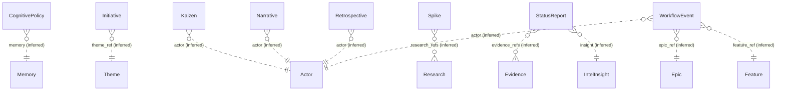

#### `tenant` (2 edges)

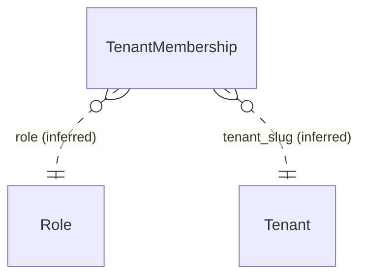

#### `testkit` (2 edges)

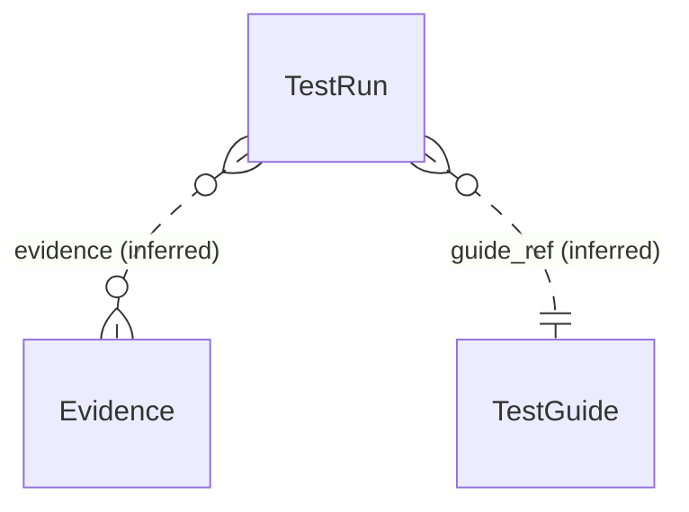

Groups with fewer than 2 edges (listed, not drawn): `agentskills`, `intel`, `kinddef`, `lesson`, `research`.

### Declared edges (`x-dna-ref`)

Enforced at write time. This table is the part of the graph the
system will not let you break.

| From | Field | To | Cardinality | Cross-group |
| --- | --- | --- | --- | --- |
| `Epic` | `features` | `Feature` | many |  |
| `Feature` | `epic` | `Epic` | one |  |
| `Feature` | `stories` | `Story` | many |  |
| `Membership` | `scope_ref` *(poly)* | `Organization` | one |  |
| `Membership` | `scope_ref` *(poly)* | `Project` | one |  |
| `Plan` | `epic` | `Epic` | one |  |
| `Plan` | `spec_ref` | `Spec` | one |  |
| `Project` | `org_ref` | `Organization` | one |  |
| `Project` | `repo_refs` | `Repo` | many |  |
| `Spec` | `epic` | `Epic` | one |  |
| `Spec` | `supersedes` | `Spec` | one |  |
| `Story` | `dependencies` | `Story` | many |  |
| `Story` | `feature` | `Feature` | one |  |
| `Story` | `spec_refs` | `Spec` | many |  |
| `Task` | `story_ref` | `Story` | one |  |

### Composition edges (`dep_filters` only)

Declared for prompt composition, never validated against stored
data. Each row is a candidate for an `x-dna-ref` promotion.

| From | Field | To | Cardinality | Cross-group |
| --- | --- | --- | --- | --- |
| `ADR` | `covers_features` | `Feature` | many |  |
| `ADR` | `superseded_by` | `ADR` | one |  |
| `ADR` | `supersedes` | `ADR` | many |  |
| `Agent` | `actors` | `Actor` | one |  |
| `Agent` | `guardrails` | `Guardrail` | many | yes |
| `Agent` | `skills` | `Skill` | many | yes |
| `Agent` | `soul` | `Soul` | one | yes |
| `Agent` | `tools` | `Tool` | many |  |
| `AgentSession` | `participants` | `Actor` | many | yes |
| `Bug` | `fix_adr` | `ADR` | one |  |
| `Bug` | `related_feature` | `Feature` | one |  |
| `Bug` | `related_story` | `Story` | one |  |
| `EvalSuite` | `cases` | `EvalCase` | many |  |
| `Feature` | `owner` | `Actor` | one | yes |
| `Feature` | `use_cases` | `UseCase` | many | yes |
| `Initiative` | `epics` | `Epic` | many |  |
| `Initiative` | `owner` | `Actor` | one | yes |
| `Issue` | `owner` | `Actor` | one | yes |
| `Issue` | `related_feature` | `Feature` | one |  |
| `Kaizen` | `issue` | `Issue` | one |  |
| `Narrative` | `covers_epics` | `Epic` | many |  |
| `Narrative` | `covers_features` | `Feature` | many |  |
| `Narrative` | `covers_stories` | `Story` | many |  |
| `Postmortem` | `related_features` | `Feature` | many |  |
| `Postmortem` | `related_stories` | `Story` | many |  |
| `Retrospective` | `covers_epics` | `Epic` | many |  |
| `Retrospective` | `covers_features` | `Feature` | many |  |
| `Retrospective` | `covers_session` | `AgentSession` | one |  |
| `Retrospective` | `covers_stories` | `Story` | many |  |
| `RiskRegister` | `owner` | `Actor` | one | yes |
| `RiskRegister` | `related_epics` | `Epic` | many |  |
| `RiskRegister` | `related_features` | `Feature` | many |  |
| `Roadmap` | `epics` | `Epic` | one |  |
| `SafetyPolicy` | `recognizers` | `Recognizer` | many | yes |
| `Spike` | `feature` | `Feature` | one |  |
| `Spike` | `follow_up_adr` | `ADR` | one |  |
| `Spike` | `follow_up_spec` | `Spec` | one |  |
| `Spike` | `follow_up_story` | `Story` | one |  |
| `Spike` | `references` | `Reference` | many |  |
| `Spike` | `related_spikes` | `Spike` | many |  |
| `Story` | `owner` | `Actor` | one | yes |
| `Task` | `owner` | `Actor` | one | yes |
| `UseCase` | `agents` | `Agent` | many |  |
| `UseCase` | `guardrails` | `Guardrail` | many | yes |
| `UseCase` | `primary_actor` | `Actor` | one |  |
| `UseCase` | `skills` | `Skill` | many | yes |
| `UseCase` | `soul` | `Soul` | one | yes |
| `UseCase` | `supporting_actors` | `Actor` | many |  |
| `UseCase` | `tools` | `Tool` | many |  |
| `WorkflowEvent` | `parent_ref` *(poly)* | `AgentSession` | one |  |
| `WorkflowEvent` | `parent_ref` *(poly)* | `Epic` | one |  |
| `WorkflowEvent` | `parent_ref` *(poly)* | `Feature` | one |  |
| `WorkflowEvent` | `parent_ref` *(poly)* | `Narrative` | one |  |
| `WorkflowEvent` | `parent_ref` *(poly)* | `Plan` | one |  |
| `WorkflowEvent` | `parent_ref` *(poly)* | `Roadmap` | one |  |
| `WorkflowEvent` | `parent_ref` *(poly)* | `Spec` | one |  |
| `WorkflowEvent` | `parent_ref` *(poly)* | `Story` | one |  |
| `WorkflowEvent` | `ref` *(poly)* | `AgentSession` | one |  |
| `WorkflowEvent` | `ref` *(poly)* | `Epic` | one |  |
| `WorkflowEvent` | `ref` *(poly)* | `Feature` | one |  |
| `WorkflowEvent` | `ref` *(poly)* | `Narrative` | one |  |
| `WorkflowEvent` | `ref` *(poly)* | `Plan` | one |  |
| `WorkflowEvent` | `ref` *(poly)* | `Roadmap` | one |  |
| `WorkflowEvent` | `ref` *(poly)* | `Spec` | one |  |
| `WorkflowEvent` | `ref` *(poly)* | `Story` | one |  |
| `WorkflowEvent` | `transitioned_from` | `WorkflowEvent` | one |  |

### Inferred edges (name convention)

Not declared anywhere. Each row is this generator matching a field
name against the Kind registry — useful, and fallible.

| From | Field | To | Cardinality | Cross-group |
| --- | --- | --- | --- | --- |
| `Actor` | `role` | `Role` | one | yes |
| `Agent` | `promptTemplate` | `PromptTemplate` | one | yes |
| `AuditLog` | `roles` | `Role` | many | yes |
| `CognitivePolicy` | `memory` | `Memory` | one | yes |
| `Engram` | `source_refs` | `IntelSource` | many | yes |
| `EvalBaseline` | `suite` | `EvalSuite` | one |  |
| `EvalRun` | `suite` | `EvalSuite` | one |  |
| `Evidence` | `suite` | `EvalSuite` | one | yes |
| `EvidencePolicy` | `events` | `WorkflowEvent` | many | yes |
| `Initiative` | `theme_ref` | `Theme` | one | yes |
| `IntelInsight` | `source_ref` | `IntelSource` | one |  |
| `Kaizen` | `actor` | `Actor` | one | yes |
| `KindDefinition` | `docs` | `Doc` | one | yes |
| `Lesson` | `skill` | `Skill` | one | yes |
| `Narrative` | `actor` | `Actor` | one | yes |
| `Research` | `sources` | `IntelSource` | many | yes |
| `Retrospective` | `actor` | `Actor` | one | yes |
| `Skill` | `references` | `Reference` | one | yes |
| `Spike` | `research_refs` | `Research` | many | yes |
| `StatusReport` | `evidence_refs` | `Evidence` | many | yes |
| `StatusReport` | `insight` | `IntelInsight` | one | yes |
| `TenantMembership` | `role` | `Role` | one | yes |
| `TenantMembership` | `tenant_slug` | `Tenant` | one |  |
| `TestRun` | `evidence` | `Evidence` | many | yes |
| `TestRun` | `guide_ref` | `TestGuide` | one |  |
| `UserRoleAssignment` | `roles` | `Role` | many | yes |
| `WorkflowEvent` | `actor` | `Actor` | one | yes |
| `WorkflowEvent` | `epic_ref` | `Epic` | one |  |
| `WorkflowEvent` | `feature_ref` | `Feature` | one |  |
| `WorkspacePlan` | `source` | `IntelSource` | one | yes |
| `WorkspacePlan` | `tier_id` | `Tier` | one |  |
| `WorkspacePlan` | `workspace_id` | `Workspace` | one | yes |

## What this model cannot express

A MER that implies completeness is worse than none. These are the
known gaps, generated alongside everything else so they cannot be
quietly dropped.

### Known-undeclarable references

Real edges that `x-dna-ref` deliberately does NOT declare. It resolves
targets by **document name**, and these are keyed by something else —
declaring them would produce false write-time violations on perfectly
valid data. This is the concrete backlog for a future `x-dna-ref-key`.

| Kind | Field | Really points at | Why undeclarable |
| --- | --- | --- | --- |
| `Comment` | `target_ref` | `any` | a composite `Kind:name` string — needs parsing, not a name lookup |
| `Membership` | `role` | `Role` | keyed by `role_id`, not the document name |
| `Organization` | `plan_ref` | `Tier` | keyed by `tier_id` (free/pro/enterprise), not the document name |
| `Project` | `workspace_id` | `Workspace` | keyed by the Workspace's opaque generated `workspace_id`, not its document name |
| `WorkspaceMembership` | `role` | `Role` | keyed by `role_id` (owner/admin/member/guest), not the document name |
| `WorkspaceMembership` | `workspace_id` | `Workspace` | same opaque `workspace_id` key |

### Unresolved reference-shaped fields

Fields that clearly point at something the model cannot name. This
shrinks when references get declared, not when the generator gets
cleverer.

| Kind | Field | Why unresolved |
| --- | --- | --- |
| `AuditLog` | `request_id` | reference-shaped, but `request` matches no registered Kind |
| `Engram` | `affect_evidence_refs` | reference-shaped, but `affect_evidence` matches no registered Kind |
| `Evidence` | `document_ref` | reference-shaped, but `document` matches no registered Kind |
| `Feature` | `sprint_ref` | reference-shaped, but `sprint` matches no registered Kind |
| `LayerPolicy` | `layer_id` | reference-shaped, but `layer` matches no registered Kind |
| `ModelProfile` | `model_id` | reference-shaped, but `model` matches no registered Kind |
| `Project` | `intel_source_refs` | reference-shaped, but `intel_source` matches no registered Kind |
| `Research` | `scope_ref` | reference-shaped, but `scope` matches no registered Kind |
| `Story` | `sprint_ref` | reference-shaped, but `sprint` matches no registered Kind |
| `TenantMembership` | `user_id` | reference-shaped, but `user` matches no registered Kind |
| `UserProfile` | `user_id` | reference-shaped, but `user` matches no registered Kind |
| `UserRoleAssignment` | `user_id` | reference-shaped, but `user` matches no registered Kind |
| `Workspace` | `plan_ref` | reference-shaped, but `plan` matches no registered Kind |
| `WorkspaceMembership` | `identity_oid` | reference-shaped, but `identity` matches no registered Kind |
| `WorkspacePlan` | `stripe_customer_id` | reference-shaped, but `stripe_customer` matches no registered Kind |
| `WorkspacePlan` | `stripe_subscription_id` | reference-shaped, but `stripe_subscription` matches no registered Kind |

### Suppressed name matches

The name-convention pass matched these and each is wrong. Listed
rather than silently dropped, so the suppression is auditable.

| Kind | Field | Why the match is wrong |
| --- | --- | --- |
| `AgentSession` | `tool` | provenance enum of the AI coding tool that produced the session (claude-code \| cursor \| cline \| …), not a `Tool` document |
| `AuditLog` | `actor` | the request identity string from claims (email/sub, or 'dev-user'), not a reference to an `Actor` document |
| `Copilot` | `tenant` | inbound-tenant handling mode for the emitted serving layer, not a reference to a `Tenant` document |
| `Organization` | `plan_ref` | the DNA Cloud Tier this org is on, not the SDLC `Plan` Kind |
| `Tenant` | `plan` | billing/feature tier (a Tier `tier_id`), not the SDLC `Plan` Kind |
| `Workspace` | `plan_ref` | DEPRECATED and never read — billing is per ACCOUNT (workspace → account_id → AccountPlan); also not the SDLC `Plan` Kind |

### Kinds with no reference edge (15)

Standalone documents — configuration, composition-plane behaviour, or
record Kinds whose links are simply not modelled yet.

`AgentDefinition`, `Automation`, `Canvas`, `Changelog`, `Comment`, `Copilot`, `Genome`, `Hook`, `HtmlArtifact`, `LayerPolicy`, `MCPFederation`, `ModelProfile`, `Setting`, `UserProfile`, `WorkspaceMembership`

## Physical model — the real tables

!!! note "This diagram carries little information, by design"

    7 tables on Postgres (4 on SQLite) and
    **0 foreign keys**. They are a generic document store:
    `documents` holds every Kind, of every type, as JSON in a
    `content` column keyed by `(scope, kind, name, tenant)`. Adding a
    Kind adds rows, never a table — so the physical diagram cannot
    show you the domain. The logical model above is where the domain
    lives. This section exists to be accurate, not to look deep.

### Postgres

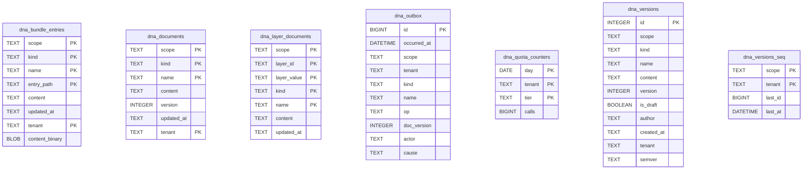

No lines connect these boxes because there are no foreign keys to
draw. The join key is `(scope, kind, name, tenant)`, applied in
application code.

### Dialect differences

The dialects are genuinely disjoint — Postgres tables carry a `dna_`
prefix, SQLite's do not, and Postgres has tables SQLite lacks.

| Postgres | SQLite |
| --- | --- |
| `dna_bundle_entries` | `bundle_entries` |
| `dna_documents` | `documents` |
| `dna_layer_documents` | `layer_documents` |
| `dna_outbox` | — |
| `dna_quota_counters` | — |
| `dna_versions` | `versions` |
| `dna_versions_seq` | — |

### Columns

#### `dna_bundle_entries`

| Column | Type | Key | Nullable |
| --- | --- | --- | --- |
| `scope` | `TEXT` | PK |  |
| `kind` | `TEXT` | PK |  |
| `name` | `TEXT` | PK |  |
| `entry_path` | `TEXT` | PK |  |
| `content` | `TEXT` |  |  |
| `updated_at` | `TEXT` |  |  |
| `tenant` | `TEXT` | PK |  |
| `content_binary` | `BLOB` |  | yes |

#### `dna_documents`

| Column | Type | Key | Nullable |
| --- | --- | --- | --- |
| `scope` | `TEXT` | PK |  |
| `kind` | `TEXT` | PK |  |
| `name` | `TEXT` | PK |  |
| `content` | `TEXT` |  |  |
| `version` | `INTEGER` |  |  |
| `updated_at` | `TEXT` |  |  |
| `tenant` | `TEXT` | PK |  |

#### `dna_layer_documents`

| Column | Type | Key | Nullable |
| --- | --- | --- | --- |
| `scope` | `TEXT` | PK |  |
| `layer_id` | `TEXT` | PK |  |
| `layer_value` | `TEXT` | PK |  |
| `kind` | `TEXT` | PK |  |
| `name` | `TEXT` | PK |  |
| `content` | `TEXT` |  |  |
| `updated_at` | `TEXT` |  |  |

#### `dna_outbox`

| Column | Type | Key | Nullable |
| --- | --- | --- | --- |
| `id` | `BIGINT` | PK |  |
| `occurred_at` | `DATETIME` |  |  |
| `scope` | `TEXT` |  |  |
| `tenant` | `TEXT` |  |  |
| `kind` | `TEXT` |  |  |
| `name` | `TEXT` |  |  |
| `op` | `TEXT` |  |  |
| `doc_version` | `INTEGER` |  |  |
| `actor` | `TEXT` |  | yes |
| `cause` | `TEXT` |  | yes |

#### `dna_quota_counters`

| Column | Type | Key | Nullable |
| --- | --- | --- | --- |
| `day` | `DATE` | PK |  |
| `tenant` | `TEXT` | PK |  |
| `tier` | `TEXT` | PK |  |
| `calls` | `BIGINT` |  |  |

#### `dna_versions`

| Column | Type | Key | Nullable |
| --- | --- | --- | --- |
| `id` | `INTEGER` | PK |  |
| `scope` | `TEXT` |  |  |
| `kind` | `TEXT` |  |  |
| `name` | `TEXT` |  |  |
| `content` | `TEXT` |  |  |
| `version` | `INTEGER` |  |  |
| `is_draft` | `BOOLEAN` |  |  |
| `author` | `TEXT` |  | yes |
| `created_at` | `TEXT` |  |  |
| `tenant` | `TEXT` |  |  |
| `semver` | `TEXT` |  | yes |

#### `dna_versions_seq`

| Column | Type | Key | Nullable |
| --- | --- | --- | --- |
| `scope` | `TEXT` | PK |  |
| `tenant` | `TEXT` | PK |  |
| `last_id` | `BIGINT` |  |  |
| `last_at` | `DATETIME` |  |  |

