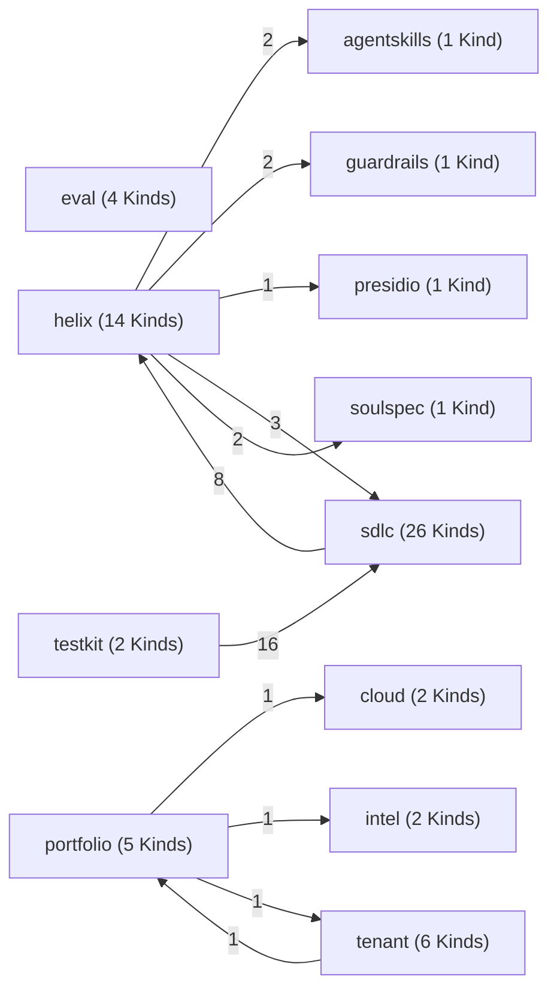
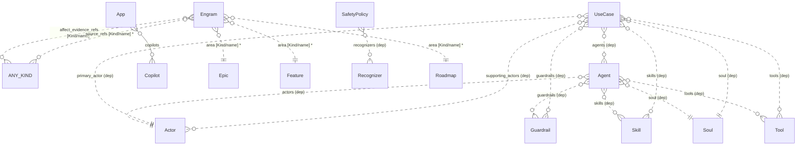
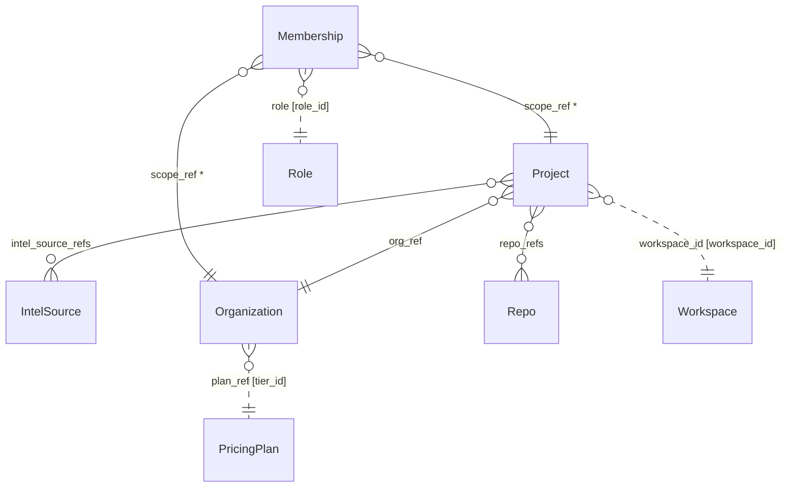
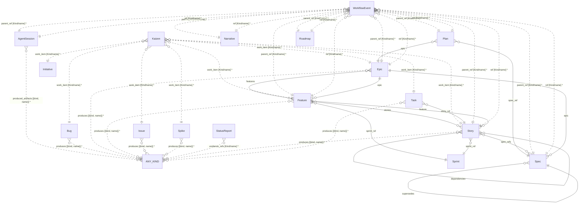
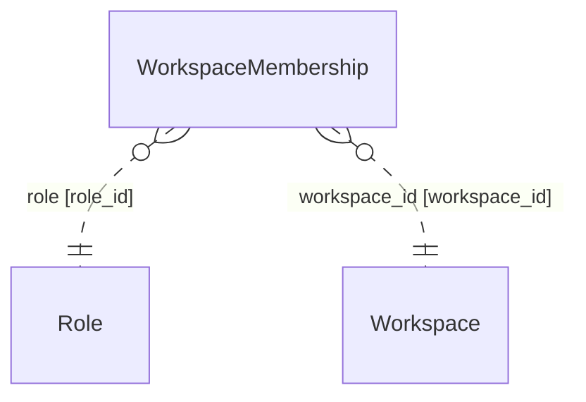
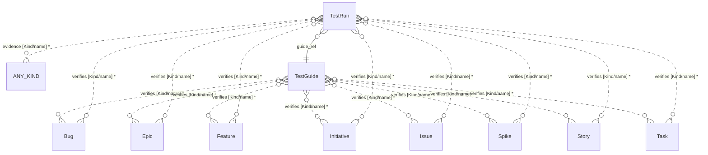

# Data model (MER)

!!! info "Generated from source — do not edit"

    Emitted by `scripts/gen_data_model_docs.py` from the live
    `Kernel.auto()` registry and the SQLAlchemy table model.
    `scripts/data_model_guard.py` fails CI when this page and a
    fresh regeneration disagree. Edit the generator, never this file.

DNA's data model has two levels. The **logical** model — Kinds and
the references between them — carries the meaning. The **physical**
model is a generic instance store that tells you almost nothing about
the domain, and this page says so rather than dressing it up.

## One database, four schema owners

A MER showing only the SDK's tables and stopping there misleads by
omission. **A single Postgres instance is shared by four independent
schema owners**, each migrating only its own tables:

| Owner | Migrates | On this page |
| --- | --- | --- |
| DNA SDK (this repo) | the instance-store tables below, via its own Alembic tree | yes — fully |
| dna-cloud portal | its Prisma schema (accounts, plans, billing — real relational tables with real foreign keys) | **no** — separate repo, separate migration tool |
| Copilot service | `copilot_thread` and friends | **no** |
| LangGraph runtime | `checkpoint*` / `store*` | **no** |

The SDK's Alembic run is explicitly told not to have opinions about
tables it does not own — otherwise autogenerate would propose
dropping another owner's data. That exclusion list is machine-
readable, so it is reproduced from source rather than asserted:

| Excluded from the SDK's autogenerate |
| --- |
| `alembic_version` |
| `dna_schema_migrations` |
| `dna_search_docs` |
| `dna_search_meta` |
| `dna_search_migrations` |
| `schema_migrations` |
| `search_docs` |
| `search_fts` |
| `search_meta` |
| `search_vec` |
| `sqlite_sequence` |

## Logical model — Kinds and their references

84 Kinds are registered. Each is an instance, not a table: a
Kind costs a YAML descriptor and zero migrations, which is the point
of an open type system. The cost is that references between Kinds are
not database foreign keys — they are fields holding a name.

### How to read the edges

Not every line here is equally trustworthy, and pretending otherwise
would be the whole problem. Two tiers, and one flag that matters more
than either:

| Tier | What it means |
| --- | --- |
| **Declared** | The Kind's `spec.relations` says so — name, target, cardinality, and (where there is one) the inverse. |
| **Composition** (`dep`) | `dep_filters` names the target Kind. A real declaration, but it drives prompt composition and is never checked against stored data. |

**Solid line = the kernel resolves it at write time. Dashed = it does not.** That is the `enforced` flag, and it is not the same as the tier: a relation addressed by a domain key (`by: workspace_id`) or carrying its Kind in the value (`to: *`) is fully declared and deliberately not followed — resolving by key needs an index the store does not have, and a second resolution rule beside a live one can veto data the live one accepts.

`*` on a label marks a polymorphic relation (several possible target Kinds, or one chosen per value). `[key]` marks the addressing when it is not the instance name.

**135 edges: 85 declared, 50 composition-only — of which 21 are ENFORCED at write time.** 26 of 84 Kinds declare at least one relation, and 25 fields are listed below as gaps.

!!! warning "Declared is not enforced"

    `dep_filters` declares a target *Kind*; nothing validates the
    *value*. A `Feature.owner` naming an Actor that does not exist is
    written without complaint. And a relation addressed by a key says
    what the value MEANS without teaching the kernel to follow it. A
    line therefore means "the model knows what this points at", and
    only a SOLID one means "the runtime checks it".

### Overview — how the groups reference each other

Kinds are grouped by alias prefix (`sdlc-`, `helix-`, …) — a grouping
that comes from the data. Arrows are counts of edges between groups;
self-references are omitted here and shown in the detail diagrams.

Relations whose target is chosen per VALUE (`to: *`) are omitted from
this view — they belong to no group, and inventing one for them would
be the projection guessing again. They appear in the detail diagrams
against `ANY_KIND` and in the declared-relations table.

```mermaid
flowchart LR
    agentskills["agentskills (1 Kind)"]
    cloud["cloud (2 Kinds)"]
    eval["eval (4 Kinds)"]
    guardrails["guardrails (1 Kind)"]
    helix["helix (14 Kinds)"]
    intel["intel (2 Kinds)"]
    portfolio["portfolio (5 Kinds)"]
    presidio["presidio (1 Kind)"]
    sdlc["sdlc (26 Kinds)"]
    soulspec["soulspec (1 Kind)"]
    tenant["tenant (6 Kinds)"]
    testkit["testkit (2 Kinds)"]
    helix -->|2| agentskills
    helix -->|2| guardrails
    helix -->|1| presidio
    helix -->|3| sdlc
    helix -->|2| soulspec
    portfolio -->|1| cloud
    portfolio -->|1| intel
    portfolio -->|1| tenant
    sdlc -->|8| helix
    tenant -->|1| portfolio
    testkit -->|16| sdlc
```

### Detail by group

All 84 Kinds in one diagram is an unreadable hairball, so
each group with at least 2 edges gets its
own. A group carrying more than 20 edges is
split again by tier, which keeps the enforced edges legible instead
of losing them among the unvalidated ones. A box from another group
appearing here is a cross-group reference.

#### `helix` (19 edges)

```mermaid
erDiagram
    ANY_KIND
    Actor
    Agent
    App
    Copilot
    Engram
    Epic
    Feature
    Guardrail
    Recognizer
    Roadmap
    SafetyPolicy
    Skill
    Soul
    Tool
    UseCase
    Agent }o..|| Actor : "actors (dep)"
    Agent }o..}o Guardrail : "guardrails (dep)"
    Agent }o..}o Skill : "skills (dep)"
    Agent }o..|| Soul : "soul (dep)"
    Agent }o..}o Tool : "tools (dep)"
    App }o--}o Copilot : "copilots"
    Engram }o..}o ANY_KIND : "affect_evidence_refs [Kind/name] *"
    Engram }o..|| Epic : "area [Kind/name] *"
    Engram }o..|| Feature : "area [Kind/name] *"
    Engram }o..|| Roadmap : "area [Kind/name] *"
    Engram }o..}o ANY_KIND : "source_refs [Kind/name] *"
    SafetyPolicy }o..}o Recognizer : "recognizers (dep)"
    UseCase }o..}o Agent : "agents (dep)"
    UseCase }o..}o Guardrail : "guardrails (dep)"
    UseCase }o..|| Actor : "primary_actor (dep)"
    UseCase }o..}o Skill : "skills (dep)"
    UseCase }o..|| Soul : "soul (dep)"
    UseCase }o..}o Actor : "supporting_actors (dep)"
    UseCase }o..}o Tool : "tools (dep)"
```

#### `portfolio` (8 edges)

```mermaid
erDiagram
    IntelSource
    Membership
    Organization
    PricingPlan
    Project
    Repo
    Role
    Workspace
    Membership }o..|| Role : "role [role_id]"
    Membership }o--|| Organization : "scope_ref *"
    Membership }o--|| Project : "scope_ref *"
    Organization }o..|| PricingPlan : "plan_ref [tier_id]"
    Project }o--}o IntelSource : "intel_source_refs"
    Project }o--|| Organization : "org_ref"
    Project }o--}o Repo : "repo_refs"
    Project }o..|| Workspace : "workspace_id [workspace_id]"
```

#### `sdlc` — declared (46 edges)

```mermaid
erDiagram
    ANY_KIND
    AgentSession
    Bug
    Epic
    Feature
    Initiative
    Issue
    Kaizen
    Narrative
    Plan
    Roadmap
    Spec
    Spike
    Sprint
    StatusReport
    Story
    Task
    WorkflowEvent
    AgentSession }o..}o ANY_KIND : "produced_artifacts [{kind, name}] *"
    Bug }o..}o ANY_KIND : "produces [{kind, name}] *"
    Epic }o--}o Feature : "features"
    Epic }o..}o ANY_KIND : "produces [{kind, name}] *"
    Feature }o--|| Epic : "epic"
    Feature }o..}o ANY_KIND : "produces [{kind, name}] *"
    Feature }o--|| Sprint : "sprint_ref"
    Feature }o--}o Story : "stories"
    Issue }o..}o ANY_KIND : "produces [{kind, name}] *"
    Kaizen }o..|| Bug : "work_item [Kind/name] *"
    Kaizen }o..|| Epic : "work_item [Kind/name] *"
    Kaizen }o..|| Feature : "work_item [Kind/name] *"
    Kaizen }o..|| Initiative : "work_item [Kind/name] *"
    Kaizen }o..|| Issue : "work_item [Kind/name] *"
    Kaizen }o..|| Spike : "work_item [Kind/name] *"
    Kaizen }o..|| Story : "work_item [Kind/name] *"
    Kaizen }o..|| Task : "work_item [Kind/name] *"
    Plan }o--|| Epic : "epic"
    Plan }o--|| Spec : "spec_ref"
    Spec }o--|| Epic : "epic"
    Spec }o--|| Spec : "supersedes"
    Spike }o..}o ANY_KIND : "produces [{kind, name}] *"
    StatusReport }o..}o ANY_KIND : "evidence_refs [Kind/name] *"
    Story }o--}o Story : "dependencies"
    Story }o--|| Feature : "feature"
    Story }o..}o ANY_KIND : "produces [{kind, name}] *"
    Story }o--}o Spec : "spec_refs"
    Story }o--|| Sprint : "sprint_ref"
    Task }o..}o ANY_KIND : "produces [{kind, name}] *"
    Task }o--|| Story : "story_ref"
    WorkflowEvent }o..|| AgentSession : "parent_ref [Kind/name] *"
    WorkflowEvent }o..|| Epic : "parent_ref [Kind/name] *"
    WorkflowEvent }o..|| Feature : "parent_ref [Kind/name] *"
    WorkflowEvent }o..|| Narrative : "parent_ref [Kind/name] *"
    WorkflowEvent }o..|| Plan : "parent_ref [Kind/name] *"
    WorkflowEvent }o..|| Roadmap : "parent_ref [Kind/name] *"
    WorkflowEvent }o..|| Spec : "parent_ref [Kind/name] *"
    WorkflowEvent }o..|| Story : "parent_ref [Kind/name] *"
    WorkflowEvent }o..|| AgentSession : "ref [Kind/name] *"
    WorkflowEvent }o..|| Epic : "ref [Kind/name] *"
    WorkflowEvent }o..|| Feature : "ref [Kind/name] *"
    WorkflowEvent }o..|| Narrative : "ref [Kind/name] *"
    WorkflowEvent }o..|| Plan : "ref [Kind/name] *"
    WorkflowEvent }o..|| Roadmap : "ref [Kind/name] *"
    WorkflowEvent }o..|| Spec : "ref [Kind/name] *"
    WorkflowEvent }o..|| Story : "ref [Kind/name] *"
```

#### `sdlc` — composition (36 edges)

```mermaid
erDiagram
    ADR
    Actor
    AgentSession
    Bug
    Epic
    Feature
    Initiative
    Issue
    Kaizen
    Narrative
    Postmortem
    Reference
    Retrospective
    RiskRegister
    Roadmap
    Spec
    Spike
    Story
    Task
    UseCase
    WorkflowEvent
    ADR }o..}o Feature : "covers_features (dep)"
    ADR }o..|| ADR : "superseded_by (dep)"
    ADR }o..}o ADR : "supersedes (dep)"
    AgentSession }o..}o Actor : "participants (dep)"
    Bug }o..|| ADR : "fix_adr (dep)"
    Bug }o..|| Feature : "related_feature (dep)"
    Bug }o..|| Story : "related_story (dep)"
    Feature }o..|| Actor : "owner (dep)"
    Feature }o..}o UseCase : "use_cases (dep)"
    Initiative }o..}o Epic : "epics (dep)"
    Initiative }o..|| Actor : "owner (dep)"
    Issue }o..|| Actor : "owner (dep)"
    Issue }o..|| Feature : "related_feature (dep)"
    Kaizen }o..|| Issue : "issue (dep)"
    Narrative }o..}o Epic : "covers_epics (dep)"
    Narrative }o..}o Feature : "covers_features (dep)"
    Narrative }o..}o Story : "covers_stories (dep)"
    Postmortem }o..}o Feature : "related_features (dep)"
    Postmortem }o..}o Story : "related_stories (dep)"
    Retrospective }o..}o Epic : "covers_epics (dep)"
    Retrospective }o..}o Feature : "covers_features (dep)"
    Retrospective }o..|| AgentSession : "covers_session (dep)"
    Retrospective }o..}o Story : "covers_stories (dep)"
    RiskRegister }o..|| Actor : "owner (dep)"
    RiskRegister }o..}o Epic : "related_epics (dep)"
    RiskRegister }o..}o Feature : "related_features (dep)"
    Roadmap }o..|| Epic : "epics (dep)"
    Spike }o..|| Feature : "feature (dep)"
    Spike }o..|| ADR : "follow_up_adr (dep)"
    Spike }o..|| Spec : "follow_up_spec (dep)"
    Spike }o..|| Story : "follow_up_story (dep)"
    Spike }o..}o Reference : "references (dep)"
    Spike }o..}o Spike : "related_spikes (dep)"
    Story }o..|| Actor : "owner (dep)"
    Task }o..|| Actor : "owner (dep)"
    WorkflowEvent }o..|| WorkflowEvent : "transitioned_from (dep)"
```

#### `tenant` (2 edges)

```mermaid
erDiagram
    Role
    Workspace
    WorkspaceMembership
    WorkspaceMembership }o..|| Role : "role [role_id]"
    WorkspaceMembership }o..|| Workspace : "workspace_id [workspace_id]"
```

#### `testkit` (18 edges)

```mermaid
erDiagram
    ANY_KIND
    Bug
    Epic
    Feature
    Initiative
    Issue
    Spike
    Story
    Task
    TestGuide
    TestRun
    TestGuide }o..}o Bug : "verifies [Kind/name] *"
    TestGuide }o..}o Epic : "verifies [Kind/name] *"
    TestGuide }o..}o Feature : "verifies [Kind/name] *"
    TestGuide }o..}o Initiative : "verifies [Kind/name] *"
    TestGuide }o..}o Issue : "verifies [Kind/name] *"
    TestGuide }o..}o Spike : "verifies [Kind/name] *"
    TestGuide }o..}o Story : "verifies [Kind/name] *"
    TestGuide }o..}o Task : "verifies [Kind/name] *"
    TestRun }o..}o ANY_KIND : "evidence [Kind/name] *"
    TestRun }o--|| TestGuide : "guide_ref"
    TestRun }o..}o Bug : "verifies [Kind/name] *"
    TestRun }o..}o Epic : "verifies [Kind/name] *"
    TestRun }o..}o Feature : "verifies [Kind/name] *"
    TestRun }o..}o Initiative : "verifies [Kind/name] *"
    TestRun }o..}o Issue : "verifies [Kind/name] *"
    TestRun }o..}o Spike : "verifies [Kind/name] *"
    TestRun }o..}o Story : "verifies [Kind/name] *"
    TestRun }o..}o Task : "verifies [Kind/name] *"
```

Groups with fewer than 2 edges (listed, not drawn): `artifact`, `collab`, `eval`, `evidence`, `intel`, `research`.

### Declared relations (`spec.relations`)

What each Kind says it points at. `Enforced` is the column that
matters: `yes` means the kernel resolves the target at write time and
the graph gets a data edge; blank means the relation is declared and
the runtime does not follow it — read `By` for why.

| From | Field | To | Cardinality | By | Enforced | Inverse of | Cross-group |
| --- | --- | --- | --- | --- | --- | --- | --- |
| `AgentSession` | `produced_artifacts` *(poly)* | `*` | many | `{kind, name}` |  |  |  |
| `App` | `copilots` | `Copilot` | many | `name` | yes |  |  |
| `Bug` | `produces` *(poly)* | `*` | many | `{kind, name}` |  |  |  |
| `Comment` | `target_ref` *(poly)* | `*` | one | `Kind:name` |  |  |  |
| `Engram` | `affect_evidence_refs` *(poly)* | `*` | many | `Kind/name` |  |  |  |
| `Engram` | `area` *(poly)* | `Epic` | one | `Kind/name` |  |  | yes |
| `Engram` | `area` *(poly)* | `Feature` | one | `Kind/name` |  |  | yes |
| `Engram` | `area` *(poly)* | `Roadmap` | one | `Kind/name` |  |  | yes |
| `Engram` | `source_refs` *(poly)* | `*` | many | `Kind/name` |  |  |  |
| `Epic` | `features` | `Feature` | many | `name` | yes | `epic` |  |
| `Epic` | `produces` *(poly)* | `*` | many | `{kind, name}` |  |  |  |
| `Evidence` | `document_ref` *(poly)* | `*` | one | `Kind:name` |  |  |  |
| `Feature` | `epic` | `Epic` | one | `name` | yes | `features` |  |
| `Feature` | `produces` *(poly)* | `*` | many | `{kind, name}` |  |  |  |
| `Feature` | `sprint_ref` | `Sprint` | one | `name` | yes |  |  |
| `Feature` | `stories` | `Story` | many | `name` | yes | `feature` |  |
| `IntelInsight` | `source_ref` | `IntelSource` | one | `name` | yes |  |  |
| `Issue` | `produces` *(poly)* | `*` | many | `{kind, name}` |  |  |  |
| `Kaizen` | `work_item` *(poly)* | `Bug` | one | `Kind/name` |  |  |  |
| `Kaizen` | `work_item` *(poly)* | `Epic` | one | `Kind/name` |  |  |  |
| `Kaizen` | `work_item` *(poly)* | `Feature` | one | `Kind/name` |  |  |  |
| `Kaizen` | `work_item` *(poly)* | `Initiative` | one | `Kind/name` |  |  |  |
| `Kaizen` | `work_item` *(poly)* | `Issue` | one | `Kind/name` |  |  |  |
| `Kaizen` | `work_item` *(poly)* | `Spike` | one | `Kind/name` |  |  |  |
| `Kaizen` | `work_item` *(poly)* | `Story` | one | `Kind/name` |  |  |  |
| `Kaizen` | `work_item` *(poly)* | `Task` | one | `Kind/name` |  |  |  |
| `Membership` | `role` | `Role` | one | `role_id` |  |  |  |
| `Membership` | `scope_ref` *(poly)* | `Organization` | one | `name` | yes |  |  |
| `Membership` | `scope_ref` *(poly)* | `Project` | one | `name` | yes |  |  |
| `Organization` | `plan_ref` | `PricingPlan` | one | `tier_id` |  |  | yes |
| `Plan` | `epic` | `Epic` | one | `name` | yes |  |  |
| `Plan` | `spec_ref` | `Spec` | one | `name` | yes |  |  |
| `Project` | `intel_source_refs` | `IntelSource` | many | `name` | yes |  | yes |
| `Project` | `org_ref` | `Organization` | one | `name` | yes |  |  |
| `Project` | `repo_refs` | `Repo` | many | `name` | yes |  |  |
| `Project` | `workspace_id` | `Workspace` | one | `workspace_id` |  |  | yes |
| `Research` | `cited_by` *(poly)* | `*` | many | `Kind/name` |  |  |  |
| `SourceArtifact` | `derived_refs` *(poly)* | `*` | many | `{kind, name}` |  |  |  |
| `Spec` | `epic` | `Epic` | one | `name` | yes |  |  |
| `Spec` | `supersedes` | `Spec` | one | `name` | yes |  |  |
| `Spike` | `produces` *(poly)* | `*` | many | `{kind, name}` |  |  |  |
| `StatusReport` | `evidence_refs` *(poly)* | `*` | many | `Kind/name` |  |  |  |
| `Story` | `dependencies` | `Story` | many | `name` | yes |  |  |
| `Story` | `feature` | `Feature` | one | `name` | yes | `stories` |  |
| `Story` | `produces` *(poly)* | `*` | many | `{kind, name}` |  |  |  |
| `Story` | `spec_refs` | `Spec` | many | `name` | yes |  |  |
| `Story` | `sprint_ref` | `Sprint` | one | `name` | yes |  |  |
| `Task` | `produces` *(poly)* | `*` | many | `{kind, name}` |  |  |  |
| `Task` | `story_ref` | `Story` | one | `name` | yes |  |  |
| `TestGuide` | `verifies` *(poly)* | `Bug` | many | `Kind/name` |  |  | yes |
| `TestGuide` | `verifies` *(poly)* | `Epic` | many | `Kind/name` |  |  | yes |
| `TestGuide` | `verifies` *(poly)* | `Feature` | many | `Kind/name` |  |  | yes |
| `TestGuide` | `verifies` *(poly)* | `Initiative` | many | `Kind/name` |  |  | yes |
| `TestGuide` | `verifies` *(poly)* | `Issue` | many | `Kind/name` |  |  | yes |
| `TestGuide` | `verifies` *(poly)* | `Spike` | many | `Kind/name` |  |  | yes |
| `TestGuide` | `verifies` *(poly)* | `Story` | many | `Kind/name` |  |  | yes |
| `TestGuide` | `verifies` *(poly)* | `Task` | many | `Kind/name` |  |  | yes |
| `TestRun` | `evidence` *(poly)* | `*` | many | `Kind/name` |  |  |  |
| `TestRun` | `guide_ref` | `TestGuide` | one | `name` | yes |  |  |
| `TestRun` | `verifies` *(poly)* | `Bug` | many | `Kind/name` |  |  | yes |
| `TestRun` | `verifies` *(poly)* | `Epic` | many | `Kind/name` |  |  | yes |
| `TestRun` | `verifies` *(poly)* | `Feature` | many | `Kind/name` |  |  | yes |
| `TestRun` | `verifies` *(poly)* | `Initiative` | many | `Kind/name` |  |  | yes |
| `TestRun` | `verifies` *(poly)* | `Issue` | many | `Kind/name` |  |  | yes |
| `TestRun` | `verifies` *(poly)* | `Spike` | many | `Kind/name` |  |  | yes |
| `TestRun` | `verifies` *(poly)* | `Story` | many | `Kind/name` |  |  | yes |
| `TestRun` | `verifies` *(poly)* | `Task` | many | `Kind/name` |  |  | yes |
| `WorkflowEvent` | `parent_ref` *(poly)* | `AgentSession` | one | `Kind/name` |  |  |  |
| `WorkflowEvent` | `parent_ref` *(poly)* | `Epic` | one | `Kind/name` |  |  |  |
| `WorkflowEvent` | `parent_ref` *(poly)* | `Feature` | one | `Kind/name` |  |  |  |
| `WorkflowEvent` | `parent_ref` *(poly)* | `Narrative` | one | `Kind/name` |  |  |  |
| `WorkflowEvent` | `parent_ref` *(poly)* | `Plan` | one | `Kind/name` |  |  |  |
| `WorkflowEvent` | `parent_ref` *(poly)* | `Roadmap` | one | `Kind/name` |  |  |  |
| `WorkflowEvent` | `parent_ref` *(poly)* | `Spec` | one | `Kind/name` |  |  |  |
| `WorkflowEvent` | `parent_ref` *(poly)* | `Story` | one | `Kind/name` |  |  |  |
| `WorkflowEvent` | `ref` *(poly)* | `AgentSession` | one | `Kind/name` |  |  |  |
| `WorkflowEvent` | `ref` *(poly)* | `Epic` | one | `Kind/name` |  |  |  |
| `WorkflowEvent` | `ref` *(poly)* | `Feature` | one | `Kind/name` |  |  |  |
| `WorkflowEvent` | `ref` *(poly)* | `Narrative` | one | `Kind/name` |  |  |  |
| `WorkflowEvent` | `ref` *(poly)* | `Plan` | one | `Kind/name` |  |  |  |
| `WorkflowEvent` | `ref` *(poly)* | `Roadmap` | one | `Kind/name` |  |  |  |
| `WorkflowEvent` | `ref` *(poly)* | `Spec` | one | `Kind/name` |  |  |  |
| `WorkflowEvent` | `ref` *(poly)* | `Story` | one | `Kind/name` |  |  |  |
| `WorkspaceMembership` | `role` | `Role` | one | `role_id` |  |  | yes |
| `WorkspaceMembership` | `workspace_id` | `Workspace` | one | `workspace_id` |  |  |  |

### Composition edges (`dep_filters` only)

Declared for prompt composition, never validated against stored
data. Each row is a candidate for promotion to a relation.

| From | Field | To | Cardinality | By | Enforced | Inverse of | Cross-group |
| --- | --- | --- | --- | --- | --- | --- | --- |
| `ADR` | `covers_features` | `Feature` | many | `name` |  |  |  |
| `ADR` | `superseded_by` | `ADR` | one | `name` |  |  |  |
| `ADR` | `supersedes` | `ADR` | many | `name` |  |  |  |
| `Agent` | `actors` | `Actor` | one | `name` |  |  |  |
| `Agent` | `guardrails` | `Guardrail` | many | `name` |  |  | yes |
| `Agent` | `skills` | `Skill` | many | `name` |  |  | yes |
| `Agent` | `soul` | `Soul` | one | `name` |  |  | yes |
| `Agent` | `tools` | `Tool` | many | `name` |  |  |  |
| `AgentSession` | `participants` | `Actor` | many | `name` |  |  | yes |
| `Bug` | `fix_adr` | `ADR` | one | `name` |  |  |  |
| `Bug` | `related_feature` | `Feature` | one | `name` |  |  |  |
| `Bug` | `related_story` | `Story` | one | `name` |  |  |  |
| `EvalSuite` | `cases` | `EvalCase` | many | `name` |  |  |  |
| `Feature` | `owner` | `Actor` | one | `name` |  |  | yes |
| `Feature` | `use_cases` | `UseCase` | many | `name` |  |  | yes |
| `Initiative` | `epics` | `Epic` | many | `name` |  |  |  |
| `Initiative` | `owner` | `Actor` | one | `name` |  |  | yes |
| `Issue` | `owner` | `Actor` | one | `name` |  |  | yes |
| `Issue` | `related_feature` | `Feature` | one | `name` |  |  |  |
| `Kaizen` | `issue` | `Issue` | one | `name` |  |  |  |
| `Narrative` | `covers_epics` | `Epic` | many | `name` |  |  |  |
| `Narrative` | `covers_features` | `Feature` | many | `name` |  |  |  |
| `Narrative` | `covers_stories` | `Story` | many | `name` |  |  |  |
| `Postmortem` | `related_features` | `Feature` | many | `name` |  |  |  |
| `Postmortem` | `related_stories` | `Story` | many | `name` |  |  |  |
| `Retrospective` | `covers_epics` | `Epic` | many | `name` |  |  |  |
| `Retrospective` | `covers_features` | `Feature` | many | `name` |  |  |  |
| `Retrospective` | `covers_session` | `AgentSession` | one | `name` |  |  |  |
| `Retrospective` | `covers_stories` | `Story` | many | `name` |  |  |  |
| `RiskRegister` | `owner` | `Actor` | one | `name` |  |  | yes |
| `RiskRegister` | `related_epics` | `Epic` | many | `name` |  |  |  |
| `RiskRegister` | `related_features` | `Feature` | many | `name` |  |  |  |
| `Roadmap` | `epics` | `Epic` | one | `name` |  |  |  |
| `SafetyPolicy` | `recognizers` | `Recognizer` | many | `name` |  |  | yes |
| `Spike` | `feature` | `Feature` | one | `name` |  |  |  |
| `Spike` | `follow_up_adr` | `ADR` | one | `name` |  |  |  |
| `Spike` | `follow_up_spec` | `Spec` | one | `name` |  |  |  |
| `Spike` | `follow_up_story` | `Story` | one | `name` |  |  |  |
| `Spike` | `references` | `Reference` | many | `name` |  |  |  |
| `Spike` | `related_spikes` | `Spike` | many | `name` |  |  |  |
| `Story` | `owner` | `Actor` | one | `name` |  |  | yes |
| `Task` | `owner` | `Actor` | one | `name` |  |  | yes |
| `UseCase` | `agents` | `Agent` | many | `name` |  |  |  |
| `UseCase` | `guardrails` | `Guardrail` | many | `name` |  |  | yes |
| `UseCase` | `primary_actor` | `Actor` | one | `name` |  |  |  |
| `UseCase` | `skills` | `Skill` | many | `name` |  |  | yes |
| `UseCase` | `soul` | `Soul` | one | `name` |  |  | yes |
| `UseCase` | `supporting_actors` | `Actor` | many | `name` |  |  |  |
| `UseCase` | `tools` | `Tool` | many | `name` |  |  |  |
| `WorkflowEvent` | `transitioned_from` | `WorkflowEvent` | one | `name` |  |  |  |

## What this model cannot express

A MER that implies completeness is worse than none. These are the
known gaps, generated alongside everything else so they cannot be
quietly dropped.

### Gaps

This shrinks when relations get declared, not when the generator gets
cleverer.

`Origin` is the column that keeps the list honest. **declared**,
**composition** and **inverse** rows are declarations the model cannot
honour — somebody wrote a target, an alias or an inverse and it does
not resolve. **undeclared** rows are fields whose NAME looks like a
reference and which nothing declares; they are usually not references
at all (an OAuth `client_id`, a Stripe customer id, an IdP subject),
and this generator no longer guesses a target for them. Reading the
two alike is how a real broken reference arrives invisible in a list
of false alarms.

The **known-undeclarable** table that used to sit here is gone, and
its absence is the point: those were real references the annotation
could not express. They are declared relations now, in the table
above, with `Enforced` blank.

| Kind | Field | Origin | Why unresolved |
| --- | --- | --- | --- |
| `AgentCatalogEntry` | `client_id` | `undeclared` | reference-shaped field name, and no relation declares what it points at |
| `AgentGrant` | `client_id` | `undeclared` | reference-shaped field name, and no relation declares what it points at |
| `AgentSession` | `session_id` | `undeclared` | reference-shaped field name, and no relation declares what it points at |
| `AuditLog` | `request_id` | `undeclared` | reference-shaped field name, and no relation declares what it points at |
| `Initiative` | `theme_ref` | `undeclared` | reference-shaped field name, and no relation declares what it points at |
| `LayerPolicy` | `layer_id` | `undeclared` | reference-shaped field name, and no relation declares what it points at |
| `ModelProfile` | `model_id` | `undeclared` | reference-shaped field name, and no relation declares what it points at |
| `PlanBinding` | `account_id` | `undeclared` | reference-shaped field name, and no relation declares what it points at |
| `PlanBinding` | `stripe_customer_id` | `undeclared` | reference-shaped field name, and no relation declares what it points at |
| `PlanBinding` | `stripe_subscription_id` | `undeclared` | reference-shaped field name, and no relation declares what it points at |
| `PlanBinding` | `tier_id` | `undeclared` | reference-shaped field name, and no relation declares what it points at |
| `PricingPlan` | `tier_id` | `undeclared` | reference-shaped field name, and no relation declares what it points at |
| `Role` | `role_id` | `undeclared` | reference-shaped field name, and no relation declares what it points at |
| `Spike` | `research_refs` | `undeclared` | reference-shaped field name, and no relation declares what it points at |
| `Sprint` | `sprint_id` | `undeclared` | reference-shaped field name, and no relation declares what it points at |
| `TenantMembership` | `tenant_slug` | `undeclared` | reference-shaped field name, and no relation declares what it points at |
| `TenantMembership` | `user_id` | `undeclared` | reference-shaped field name, and no relation declares what it points at |
| `UserProfile` | `user_id` | `undeclared` | reference-shaped field name, and no relation declares what it points at |
| `UserRoleAssignment` | `user_id` | `undeclared` | reference-shaped field name, and no relation declares what it points at |
| `WorkflowEvent` | `epic_ref` | `undeclared` | reference-shaped field name, and no relation declares what it points at |
| `WorkflowEvent` | `feature_ref` | `undeclared` | reference-shaped field name, and no relation declares what it points at |
| `Workspace` | `account_id` | `undeclared` | reference-shaped field name, and no relation declares what it points at |
| `Workspace` | `workspace_id` | `undeclared` | reference-shaped field name, and no relation declares what it points at |
| `WorkspaceMembership` | `identity_oid` | `undeclared` | reference-shaped field name, and no relation declares what it points at |
| `WorkspaceScopeGrant` | `workspace_id` | `undeclared` | reference-shaped field name, and no relation declares what it points at |

### Kinds with no reference edge (32)

Standalone instances — configuration, composition-plane behaviour, or
record Kinds whose links are simply not modelled yet.

`AgentCatalogEntry`, `AgentDefinition`, `AgentGrant`, `AuditLog`, `Automation`, `Canvas`, `Changelog`, `CognitivePolicy`, `Doc`, `EvalBaseline`, `EvalRun`, `EvidencePolicy`, `Genome`, `Hook`, `HtmlArtifact`, `KindDefinition`, `KindNamespace`, `LayerPolicy`, `Lesson`, `MCPFederation`, `Memory`, `ModelProfile`, `PlanBinding`, `PromptTemplate`, `RemoteAgent`, `Setting`, `Tenant`, `TenantMembership`, `Theme`, `UserProfile`, `UserRoleAssignment`, `WorkspaceScopeGrant`

## Physical model — the real tables

!!! note "This diagram carries little information, by design"

    11 tables on Postgres (5 on SQLite) and
    **1 foreign keys**. They are a generic instance store:
    `instances` holds every Kind, of every type, as JSON in a
    `content` column keyed by `(scope, kind, name, tenant)`. Adding a
    Kind adds rows, never a table — so the physical diagram cannot
    show you the domain. The logical model above is where the domain
    lives. This section exists to be accurate, not to look deep.

### Postgres

```mermaid
erDiagram
    dna_approval {
        TEXT approval_id PK
        TEXT turn_id
        TEXT thread_id
        TEXT workspace
        TEXT oid
        TEXT actor_email
        TEXT tool
        TEXT arguments
        TEXT decision
        TEXT edited_args
        TEXT reason
        DATETIME requested_at
        DATETIME decided_at
    }
    dna_bundle_entries {
        TEXT scope PK
        TEXT kind PK
        TEXT api_version PK
        TEXT name PK
        TEXT entry_path PK
        TEXT content
        TEXT updated_at
        TEXT tenant PK
        BLOB content_binary
    }
    dna_edges {
        TEXT scope PK
        TEXT tenant PK
        TEXT from_api_version PK
        TEXT from_kind PK
        TEXT from_name PK
        TEXT source_field PK
        INTEGER ordinal PK
        TEXT to_scope
        TEXT to_kind
        TEXT to_name
        TEXT declared_to
        INTEGER from_version
        DATETIME updated_at
    }
    dna_instances {
        TEXT scope PK
        TEXT kind PK
        TEXT api_version PK
        TEXT name PK
        TEXT content
        INTEGER version
        TEXT updated_at
        TEXT tenant PK
    }
    dna_layer_instances {
        TEXT scope PK
        TEXT layer_id PK
        TEXT layer_value PK
        TEXT kind PK
        TEXT name PK
        TEXT content
        TEXT updated_at
    }
    dna_outbox {
        BIGINT id PK
        DATETIME occurred_at
        TEXT scope
        TEXT tenant
        TEXT kind
        TEXT name
        TEXT op
        INTEGER doc_version
        TEXT actor
        TEXT cause
    }
    dna_quota_counters {
        DATE day PK
        TEXT tenant PK
        TEXT tier PK
        BIGINT calls
    }
    dna_turn {
        TEXT turn_id PK
        TEXT trace_id
        TEXT thread_id
        TEXT workspace
        TEXT oid
        TEXT agent
        TEXT model
        TEXT input_text
        TEXT output_text
        INTEGER input_tokens
        INTEGER output_tokens
        TEXT status
        TEXT error
        DATETIME started_at
        DATETIME ended_at
        INTEGER duration_ms
    }
    dna_turn_step {
        TEXT turn_id PK
        INTEGER step_index PK
        TEXT name
        TEXT input
        TEXT output
        TEXT status
        TEXT error
        DATETIME started_at
        INTEGER duration_ms
    }
    dna_versions {
        INTEGER id PK
        TEXT scope
        TEXT kind
        TEXT api_version
        TEXT name
        TEXT content
        INTEGER version
        BOOLEAN is_draft
        TEXT author
        TEXT created_at
        TEXT tenant
        TEXT semver
    }
    dna_versions_seq {
        TEXT scope PK
        TEXT tenant PK
        BIGINT last_id
        DATETIME last_at
    }
```

No lines connect these boxes because there are no foreign keys to
draw. The join key is `(scope, kind, name, tenant)`, applied in
application code.

### Dialect differences

The dialects are genuinely disjoint — Postgres tables carry a `dna_`
prefix, SQLite's do not, and Postgres has tables SQLite lacks.

| Postgres | SQLite |
| --- | --- |
| `dna_approval` | — |
| `dna_bundle_entries` | `bundle_entries` |
| `dna_edges` | `edges` |
| `dna_instances` | `instances` |
| `dna_layer_instances` | `layer_instances` |
| `dna_outbox` | — |
| `dna_quota_counters` | — |
| `dna_turn` | — |
| `dna_turn_step` | — |
| `dna_versions` | `versions` |
| `dna_versions_seq` | — |

### Columns

#### `dna_approval`

| Column | Type | Key | Nullable |
| --- | --- | --- | --- |
| `approval_id` | `TEXT` | PK |  |
| `turn_id` | `TEXT` |  |  |
| `thread_id` | `TEXT` |  |  |
| `workspace` | `TEXT` |  |  |
| `oid` | `TEXT` |  |  |
| `actor_email` | `TEXT` |  |  |
| `tool` | `TEXT` |  |  |
| `arguments` | `TEXT` |  |  |
| `decision` | `TEXT` |  |  |
| `edited_args` | `TEXT` |  |  |
| `reason` | `TEXT` |  |  |
| `requested_at` | `DATETIME` |  |  |
| `decided_at` | `DATETIME` |  | yes |

#### `dna_bundle_entries`

| Column | Type | Key | Nullable |
| --- | --- | --- | --- |
| `scope` | `TEXT` | PK |  |
| `kind` | `TEXT` | PK |  |
| `api_version` | `TEXT` | PK |  |
| `name` | `TEXT` | PK |  |
| `entry_path` | `TEXT` | PK |  |
| `content` | `TEXT` |  |  |
| `updated_at` | `TEXT` |  |  |
| `tenant` | `TEXT` | PK |  |
| `content_binary` | `BLOB` |  | yes |

#### `dna_edges`

| Column | Type | Key | Nullable |
| --- | --- | --- | --- |
| `scope` | `TEXT` | PK |  |
| `tenant` | `TEXT` | PK |  |
| `from_api_version` | `TEXT` | PK |  |
| `from_kind` | `TEXT` | PK |  |
| `from_name` | `TEXT` | PK |  |
| `source_field` | `TEXT` | PK |  |
| `ordinal` | `INTEGER` | PK |  |
| `to_scope` | `TEXT` |  | yes |
| `to_kind` | `TEXT` |  | yes |
| `to_name` | `TEXT` |  |  |
| `declared_to` | `TEXT` |  |  |
| `from_version` | `INTEGER` |  |  |
| `updated_at` | `DATETIME` |  |  |

#### `dna_instances`

| Column | Type | Key | Nullable |
| --- | --- | --- | --- |
| `scope` | `TEXT` | PK |  |
| `kind` | `TEXT` | PK |  |
| `api_version` | `TEXT` | PK |  |
| `name` | `TEXT` | PK |  |
| `content` | `TEXT` |  |  |
| `version` | `INTEGER` |  |  |
| `updated_at` | `TEXT` |  |  |
| `tenant` | `TEXT` | PK |  |

#### `dna_layer_instances`

| Column | Type | Key | Nullable |
| --- | --- | --- | --- |
| `scope` | `TEXT` | PK |  |
| `layer_id` | `TEXT` | PK |  |
| `layer_value` | `TEXT` | PK |  |
| `kind` | `TEXT` | PK |  |
| `name` | `TEXT` | PK |  |
| `content` | `TEXT` |  |  |
| `updated_at` | `TEXT` |  |  |

#### `dna_outbox`

| Column | Type | Key | Nullable |
| --- | --- | --- | --- |
| `id` | `BIGINT` | PK |  |
| `occurred_at` | `DATETIME` |  |  |
| `scope` | `TEXT` |  |  |
| `tenant` | `TEXT` |  |  |
| `kind` | `TEXT` |  |  |
| `name` | `TEXT` |  |  |
| `op` | `TEXT` |  |  |
| `doc_version` | `INTEGER` |  |  |
| `actor` | `TEXT` |  | yes |
| `cause` | `TEXT` |  | yes |

#### `dna_quota_counters`

| Column | Type | Key | Nullable |
| --- | --- | --- | --- |
| `day` | `DATE` | PK |  |
| `tenant` | `TEXT` | PK |  |
| `tier` | `TEXT` | PK |  |
| `calls` | `BIGINT` |  |  |

#### `dna_turn`

| Column | Type | Key | Nullable |
| --- | --- | --- | --- |
| `turn_id` | `TEXT` | PK |  |
| `trace_id` | `TEXT` |  |  |
| `thread_id` | `TEXT` |  |  |
| `workspace` | `TEXT` |  |  |
| `oid` | `TEXT` |  |  |
| `agent` | `TEXT` |  |  |
| `model` | `TEXT` |  |  |
| `input_text` | `TEXT` |  | yes |
| `output_text` | `TEXT` |  | yes |
| `input_tokens` | `INTEGER` |  |  |
| `output_tokens` | `INTEGER` |  |  |
| `status` | `TEXT` |  |  |
| `error` | `TEXT` |  | yes |
| `started_at` | `DATETIME` |  |  |
| `ended_at` | `DATETIME` |  | yes |
| `duration_ms` | `INTEGER` |  |  |

#### `dna_turn_step`

| Column | Type | Key | Nullable |
| --- | --- | --- | --- |
| `turn_id` | `TEXT` | PK |  |
| `step_index` | `INTEGER` | PK |  |
| `name` | `TEXT` |  |  |
| `input` | `TEXT` |  | yes |
| `output` | `TEXT` |  | yes |
| `status` | `TEXT` |  |  |
| `error` | `TEXT` |  | yes |
| `started_at` | `DATETIME` |  |  |
| `duration_ms` | `INTEGER` |  |  |

#### `dna_versions`

| Column | Type | Key | Nullable |
| --- | --- | --- | --- |
| `id` | `INTEGER` | PK |  |
| `scope` | `TEXT` |  |  |
| `kind` | `TEXT` |  |  |
| `api_version` | `TEXT` |  |  |
| `name` | `TEXT` |  |  |
| `content` | `TEXT` |  |  |
| `version` | `INTEGER` |  |  |
| `is_draft` | `BOOLEAN` |  |  |
| `author` | `TEXT` |  | yes |
| `created_at` | `TEXT` |  |  |
| `tenant` | `TEXT` |  |  |
| `semver` | `TEXT` |  | yes |

#### `dna_versions_seq`

| Column | Type | Key | Nullable |
| --- | --- | --- | --- |
| `scope` | `TEXT` | PK |  |
| `tenant` | `TEXT` | PK |  |
| `last_id` | `BIGINT` |  |  |
| `last_at` | `DATETIME` |  |  |

